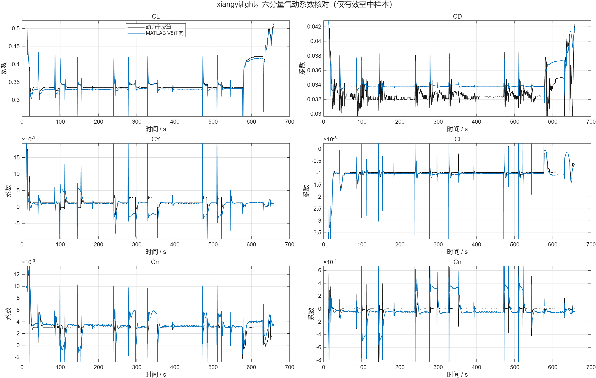
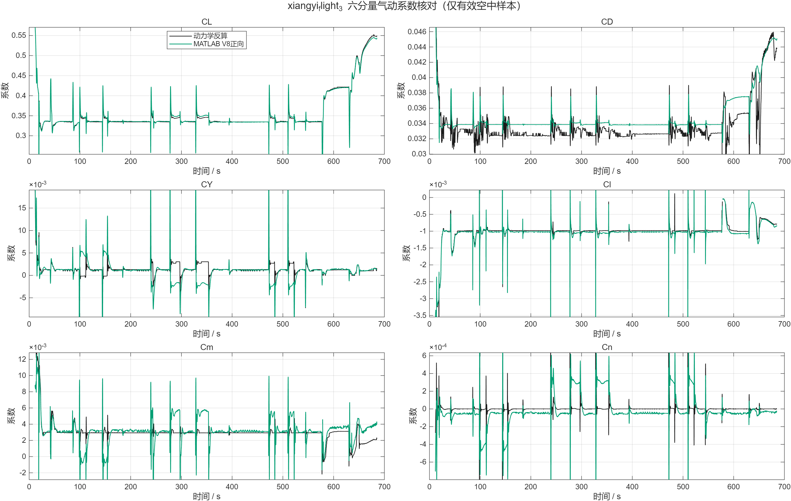
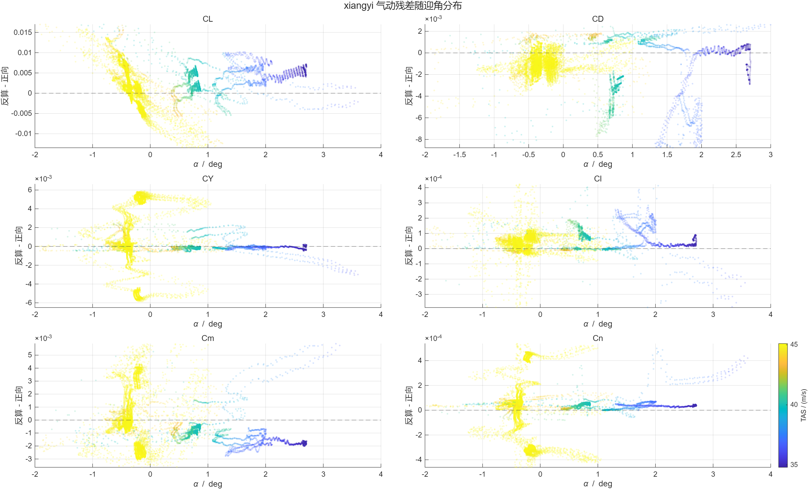
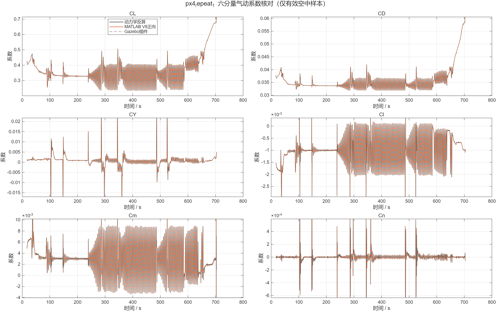
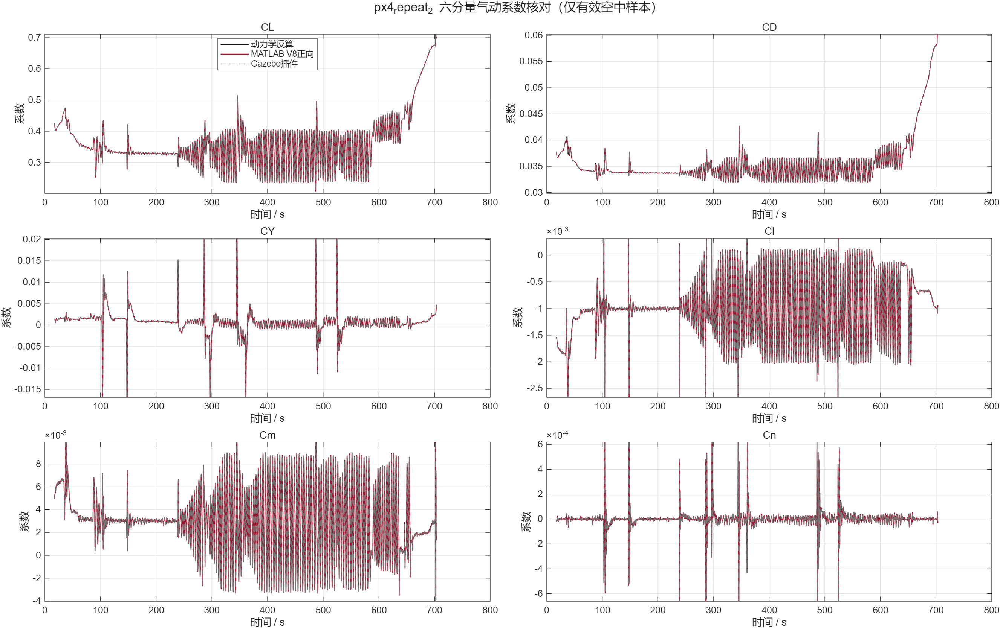
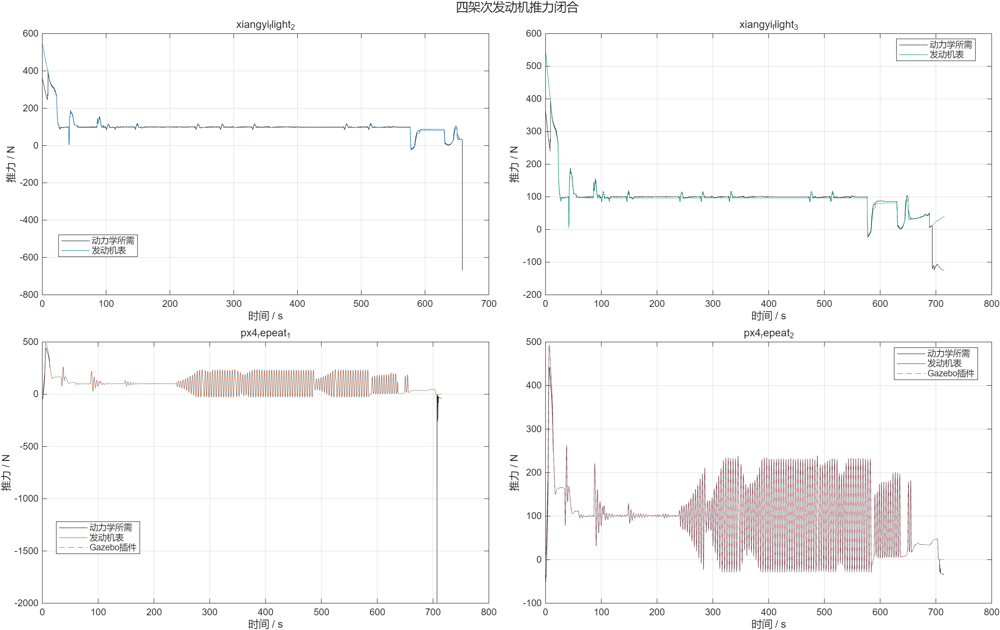

# 鸿鹄翼 V8 100 kg 双数据源气动模型核对

日期：2026-07-31
对象：翔仪第二、第三次完整仿真；PX4/Gazebo 4038 两次完整任务仿真
性质：离线动力学闭合与模型一致性检查，不进行参数辨识

## 1. 结论摘要

本轮用同一套 MATLAB 顺序脚本，对翔仪和PX4两种日志执行了相同的六自由度反算与V8
气动模型正向计算。最终结论如下。

| 检查对象 | 结论 | 主要依据 |
|---|---|---|
| 翔仪`CL` | 条件一致 | 两架NRMSE为1.55%/0.89%，相关系数0.9969/0.9984 |
| 翔仪`Cl` | 条件一致 | 两架NRMSE为1.25%/1.30%，相关系数0.9822/0.9765 |
| 翔仪`CD` | 量级一致，但未达到双架高相关门槛 | NRMSE为6.34%/5.60%；相关系数0.7725/0.9019；对推力假设敏感 |
| 翔仪`CY` | 证据不足 | NRMSE约4%，但相关系数仅0.68/0.71，侧滑激励较小 |
| 翔仪`Cm` | 证据不足 | NRMSE约5.2%/5.5%，相关系数0.68/0.62，动态范围偏小 |
| 翔仪`Cn` | 证据不足 | NRMSE约5.7%/5.4%，相关系数0.51/0.53，偏航激励不足 |
| PX4 MATLAB正向—Gazebo插件 | 通过 | 六分量RMSE约`4e-10～1.7e-6`，远小于建议限值 |
| PX4动力学反算—正向模型 | 基本通过 | 5个系数满足建议上限；`CD≈2.5e-4`，略高于`2.0e-4`建议值 |
| 发动机表—PX4插件 | 通过 | 推力RMSE 0.122/0.126 N，扭矩RMSE 0.0123/0.0127 N·m |
| 翔仪巡航推进闭合 | 条件一致 | 反算所需推力99.72/99.89 N，表值96.51 N，差约3.2%～3.4% |

因此可以说：

> 在100 kg质量、Word表3插值惯量、翔仪RFU坐标解释、
> `min(1.25×FW_Thr/100,1)`油门映射和当前`+Mx_FRD`反扭矩条件假设下，
> 翔仪与V8的升力、滚转力矩和巡航推进量级具有很强相容性；阻力总体接近但依赖推进
> 假设，横侧向及俯仰力矩缺少充分激励，不能据此宣称六分量模型已被完全证明相同。

## 2. 版本、输入与可追溯性

### 2.1 代码边界

```text
仓库：/home/fly/PX4-Autopilot-NewAero
分支：main
HEAD：89c1008a5a04bcc688579a7b1b30df7022c018fb
本轮开始时未提交差异SHA-256：
7c030208218a2f5b45cfa2dfa05d92faf7bdbb3db62c6161ac559ae7b0bd1da3
```

100 kg只使用隔离机型：

```text
ROMFS/px4fmu_common/init.d-posix/airframes/
4038_gz_honghu_wing_100kg_v8_xiangyi_test
```

重新生成100 kg SDF后，150 kg源SDF哈希仍为
`834542b5905ad78ce5174c5d694f19d570ba1588c9da9b9972a885c4528f3c66`，
没有修改4028、150 kg模型、气动表或发动机表。

### 2.2 原始数据

| 输入 | SHA-256 |
|---|---|
| `翔仪飞控仿真结果.csv` | `07513903f0f621d3838bcbaa7bb705b55e294c149bd3121ff5336fb2b2e8bd07` |
| `模仿XY航线规划.plan` | `2b055389af84edbea3912576c3504c16ead5fb560f25d24fc08fc4beb5175793` |
| 参数Word V2.5(2) | `22072b5d65a2fc31fe09e7484e34a9a97e6f248b186b5314669648452fdfbfff` |
| PX4 repeat 1 `20_32_50.ulg` | `1a9e0498fbb0b57cb8bcd3b8bcc899564a5dff5b8ae40064f550ec65eb069ee1` |
| PX4 repeat 2 `20_58_05.ulg` | `cce73063e69f60da54d228564b7650eafe03287e789e75eeb6c1b66226adf563` |

翔仪CSV为GB18030编码、577列、约20 Hz。第一架存在经纬度跳变，只进入数据质量说明；
正式统计采用第二、第三次完整飞行。两次PX4 ULog都记录了实际舵面关节、V8气动插件
状态、推进插件状态、估计器偏置、角速度、加速度和Gazebo地面真值。

完整机器可读清单见：

```text
/home/fly/PX4-Autopilot-NewAero/
analysis_outputs/honghu_v8_xiangyi_latest_20260731/provenance.json
```

## 3. 100 kg模型参数与坐标约定

### 3.1 几何、质量和惯量

| 参数 | 数值 |
|---|---:|
| 质量`m` | 100 kg |
| 参考面积`S` | 2.42 m² |
| 翼展`b` | 3.96 m |
| 平均气动弦`c` | 0.62 m |
| PDF/CAD质心 | `xCG=-1.57 m` |

Word表3给出73 kg和150 kg两套惯量，本轮按质量线性插值得到：

```text
[Ixx,Iyy,Izz,Ixy,Ixz,Iyz]
= [25.515844, 33.730909, 53.834286,
   -0.019597, -2.917403, -0.000796] kg·m²
```

MATLAB采用完整FRD惯量矩阵：

```text
I_FRD =
[ 25.515844  -0.019597  -2.917403
  -0.019597  33.730909  -0.000796
  -2.917403  -0.000796  53.834286 ] kg·m²
```

这是73/150 kg数据之间的推导值，不是100 kg构型的直接测量值。

### 3.2 坐标系

```text
PX4/PDF机体系：FRD，X前、Y右、Z下
Gazebo局部系：FLU，X前、Y左、Z上
PX4导航系：NED，X北、Y东、Z下
Gazebo世界系：ENU，X东、Y北、Z上
翔仪机体系：RFU，X右、Y前、Z上
```

翔仪转换：

```text
v_FRD = [vY_RFU, vX_RFU, -vZ_RFU]
ω_FRD = deg2rad([wY, wX, -wZ])
f_FRD = 9.8 × [Acc_Y, Acc_X, -Acc_Z]
```

PX4日志直接使用NED/FRD定义。舵偏不取执行器命令，而是由Gazebo实际关节角重算：

```text
δa = 0.5×(-θ左副翼+θ右副翼)
δe = 0.5×( θ左升降舵+θ右升降舵)
δr = 0.5×( θ左方向舵+θ右方向舵)
δc = 0.5×( θ左鸭翼+θ右鸭翼)
```

### 3.3 数据自检

| 架次 | TAS—机体速度模RMSE (m/s) | 比力X/Y/Z交叉检查RMSE (m/s²) |
|---|---:|---:|
| 翔仪2 | 0.0497 | CSV内部运动学检查通过 |
| 翔仪3 | 0.0538 | CSV内部运动学检查通过 |
| PX4 repeat 1 | 0.00581 | 0.1320 / 0.0512 / 0.0283 |
| PX4 repeat 2 | 0.00555 | 0.1103 / 0.0520 / 0.0261 |

PX4比力交叉检查只使用`AGL≥5 m、TAS≥20 m/s`空中样本，排除了地面碰撞脉冲。

## 4. 发动机模型假设

V8发动机表按空速、高度和滤波油门插值推力、RPM和扭矩，推力方向在Gazebo FLU中为
`[cos3°,0,-sin3°]`，换到FRD后为`[cos3°,0,+sin3°]`，即3°向下。

```text
发动机点（Gazebo FLU）：[-1.23, 0, +0.12] m
发动机点（FRD）：       [-1.23, 0, -0.12] m
油门上升/下降时间常数：0.5 / 0.3 s
```

4038为翔仪条件对比副本，反扭矩使用`+Mx_FRD`。稳定150 kg模型仍保持其原有
`-Mx_FRD`定义，本轮没有改动。翔仪没有独立发动机反馈，因此采用：

```text
throttle_state = min(1.25 × FW_Thr / 100, 1)
```

这使翔仪约65%控制油门映射到约81.25%发动机表工况。该映射及反扭矩符号是条件假设，
不是翔仪接口的直接反馈值。

## 5. 统一MATLAB顺序脚本

目录：

```text
/home/fly/PX4-Autopilot-NewAero/
Tools/honghu/matlab/xiangyi_px4_100kg_latest/
  run_00_all.m
  step_01_config_and_tables.m
  step_02_import_and_normalize_logs.m
  step_03_compute_aero_coefficients.m
  step_04_export_aero_comparison.m
  step_05_compare_closed_loop.m
```

原计划中的`00_...m`命名改为`run_00_...m`，原因是MATLAB脚本名必须以字母开头。
全部文件均为从上到下执行的脚本，不含自定义`function`；MATLAB R2025a
`checkcode`六个文件均为0条消息。

Windows MATLAB运行：

```matlab
run("\\wsl.localhost\Ubuntu-22.04\home\fly\PX4-Autopilot-NewAero\" + ...
    "Tools\honghu\matlab\xiangyi_px4_100kg_latest\run_00_all.m")
```

五个步骤依次完成配置、双日志导入、六分量计算、气动图表导出和闭环轨迹比较。

## 6. 动力学与正向模型

动力学反算：

```text
F_aero = m f_specific - F_prop
M_aero = I·ωdot + ω×(Iω) - M_prop
```

再按风轴/机体系定义转换为：

```text
CL = -F_aero·e_z / (qS)
CD = -F_aero·e_x / (qS)
CY =  F_aero·e_y / (qS)
Cl = Mx / (qSb)
Cm = My / (qSc)
Cn = Mz / (qSb)
```

正向链使用当前V8静态表、舵效表、动导数、低速保护和发动机表，不拟合任何参数。
PX4正向链使用插件实际采用的相对气流、FRD角速度及50 Hz内部滤波后的
`αdot/βdot`；若从20 Hz导航真值重新求导，会把离散误差误认为气动模型误差。

主有效样本：

```text
TAS >= 20 m/s
AGL >= 5 m
qbar >= 200 Pa
无地面接触
推进表未越界
状态、舵角和导数连续有限
```

2026-07-31绘图复核：原六分量时序图误把起飞前和接地后的反算值画入纵轴。此时动压
接近零，除以`qS`会把微小加速度噪声放大到`1e10`以上。当前图片仅显示上述有效空中
样本，无效区间以`NaN`断线，纵轴使用有效样本0.5%～99.5%稳健范围。原始CSV、有效
样本判据和统计指标均未删除或更改。

角速度使用0.5 s零相位Hann平滑后求导，并检查0.25/1.0 s窗口。

## 7. 翔仪六分量结果

### 7.1 全部有效空中样本

| 架次 | 系数 | bias | RMSE | 相关系数 | 回归斜率 | NRMSE |
|---|---|---:|---:|---:|---:|---:|
| 翔仪2 | CL | +0.004404 | 0.005346 | 0.9969 | 0.9828 | 1.55% |
| 翔仪2 | CD | −0.001431 | 0.001886 | 0.7725 | 0.8694 | 6.34% |
| 翔仪2 | CY | +0.000506 | 0.002133 | 0.6766 | 0.5663 | 4.34% |
| 翔仪2 | Cl | +0.0000447 | 0.0000868 | 0.9822 | 0.9386 | 1.25% |
| 翔仪2 | Cm | −0.000405 | 0.001359 | 0.6805 | 0.5393 | 5.16% |
| 翔仪2 | Cn | +0.0000133 | 0.0001565 | 0.5131 | 0.3154 | 5.73% |
| 翔仪3 | CL | −0.000364 | 0.003079 | 0.9984 | 1.0120 | 0.89% |
| 翔仪3 | CD | −0.001147 | 0.001679 | 0.9019 | 0.9987 | 5.60% |
| 翔仪3 | CY | +0.000395 | 0.001959 | 0.7060 | 0.5985 | 3.97% |
| 翔仪3 | Cl | +0.0000396 | 0.0000898 | 0.9765 | 0.9798 | 1.30% |
| 翔仪3 | Cm | −0.000260 | 0.001348 | 0.6248 | 0.5242 | 5.50% |
| 翔仪3 | Cn | +0.0000202 | 0.0001467 | 0.5329 | 0.3392 | 5.37% |





### 7.2 如何解释

- `CL`在两架中都同时满足小偏差、小NRMSE和高相关，是最有力的一致性证据。
- `Cl`同样高度相关，说明副翼、侧滑及滚转动导数的组合响应在现有工况下相容。
- `CD`的绝对偏差不大，但它直接受发动机推力扣除影响。推力±20%时翔仪`CD`最大
  RMSE可到0.00872，因此不能把当前`CD`残差全部归因于气动阻力表。
- `CY/Cn`的幅值和NRMSE不大，但相关性不足，主要限制是侧滑/偏航激励太小。
- `Cm`均值偏差较小，但可用动态幅值不足以支撑高相关判断；舵角并非真实舵机反馈也
  进一步限制了结论等级。

残差随状态分布：



## 8. PX4三条校验链

### 8.1 MATLAB正向模型—Gazebo插件

| 系数 | repeat 1 RMSE | repeat 2 RMSE | 建议上限 |
|---|---:|---:|---:|
| CL | 4.30e−7 | 5.62e−7 | 1.5e−3 |
| CD | 2.13e−7 | 3.48e−7 | 2.0e−4 |
| CY | 1.95e−9 | 4.23e−9 | 5.0e−4 |
| Cl | 3.43e−8 | 7.17e−8 | 5.0e−5 |
| Cm | 8.01e−7 | 1.73e−6 | 5.0e−4 |
| Cn | 3.91e−10 | 1.46e−9 | 5.0e−5 |

该结果证明MATLAB正向链已逐项复现运行中的V8插件计算。

### 8.2 动力学反算—MATLAB正向模型

| 系数 | repeat 1 RMSE | repeat 2 RMSE | 判断 |
|---|---:|---:|---|
| CL | 0.000553 | 0.000544 | 通过 |
| CD | 0.000252 | 0.000248 | 略高于0.0002建议值 |
| CY | 0.000039 | 0.000039 | 通过 |
| Cl | 0.000023 | 0.000021 | 通过 |
| Cm | 0.000105 | 0.000126 | 通过 |
| Cn | 0.000007 | 0.000007 | 通过 |

`CD`的小幅超限没有同时出现在“正向—插件”链，因此优先解释为加速度带宽、20 Hz
重采样和推进扣除误差，而不是气动表计算错误。





## 9. 推进闭合与敏感性

| 架次 | 巡航所需推力 (N) | 表推力 (N) | 推力闭合RMSE (N) | 所需反扭矩 (N·m) | 表扭矩 (N·m) |
|---|---:|---:|---:|---:|---:|
| 翔仪2 | 99.72 | 96.51 | 3.57 | 11.85 | 11.46 |
| 翔仪3 | 99.89 | 96.51 | 3.69 | 11.86 | 11.46 |
| PX4 repeat 1 | 101.52 | 101.50 | 0.52 | 11.93 | 11.92 |
| PX4 repeat 2 | 101.91 | 101.87 | 0.52 | 11.97 | 11.96 |



敏感性检查包括：

- 0.25/0.5/1.0 s Hann窗口；
- 翔仪9.8/9.80665重力常数；
- 翔仪`NavAltitude`与`NavHeight`密度口径；
- PX4模型ISA密度与日志密度；
- 推力和推进力矩同时按0.8/1.2缩放。

滤波、重力和密度选择不改变`CL/Cl`的总体判断。推力缩放明显改变`CD`，再次说明
翔仪阻力结论必须附带推进模型条件。所有逐系数结果见
`aero/sensitivity_metrics.csv`。

## 10. 限制与后续建议

1. 翔仪没有实际舵机反馈，本轮把`FW_Ail/FW_Ele/FW_Rud/Canard`当作直接舵角。
2. 翔仪推进反馈缺失，1.25油门映射和`+Mx_FRD`属于当前最自洽的条件假设。
3. 100 kg惯量由73/150 kg线性插值得到。
4. 当前任务不是专门的气动激励试验，`CY/Cm/Cn`变化量不足。
5. PX4动力学闭合中的`CD`略超建议上限，应在专门恒速直线试验中用更高频真值加速度
   再核查，不应直接修改阻力表。
6. 若需要把“条件一致”提升为“已确认”，应取得翔仪内部实际舵面状态、发动机查表
   接口说明和质量惯量矩阵，或设计包含横侧向双向激励的开环/弱闭环验证工况。

## 11. 输出目录

```text
/home/fly/PX4-Autopilot-NewAero/
analysis_outputs/honghu_v8_xiangyi_latest_20260731/matlab/aero/
  coefficient_timeseries.csv
  coefficient_metrics.csv
  px4_plugin_crosscheck_metrics.csv
  engine_metrics.csv
  sensitivity_metrics.csv
  dual_source_aero_summary.json
  dual_source_aero_results.mat
  *.png
```

本报告只判定模型和动力学闭合。轨迹、制导和飞控差异见：

```text
HONGHU_V8_100KG_LATEST_CONTROL_XIANGYI_COMPARISON_2026-07-31.md
```
