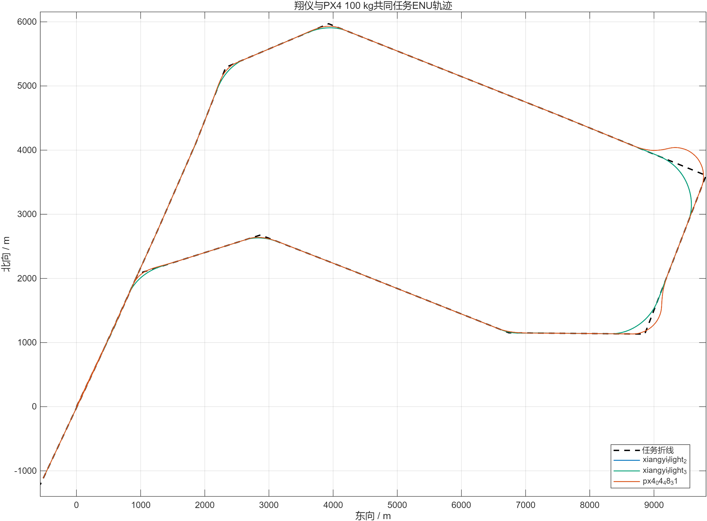
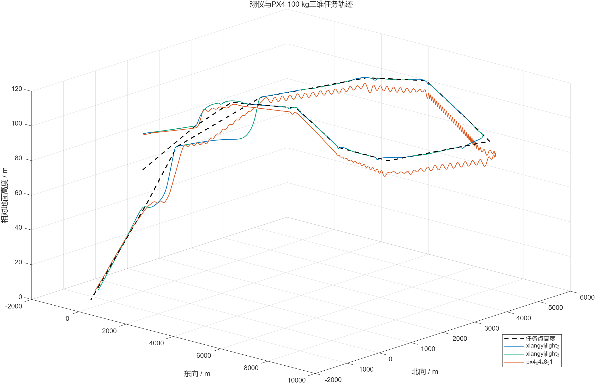
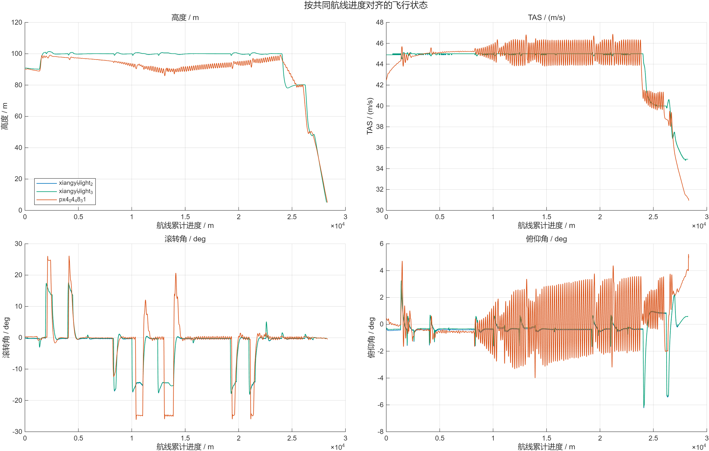

# 鸿鹄翼 V8 100 kg 最新控制逻辑与翔仪闭环仿真对比

日期：2026-07-31
任务：`模仿XY航线规划.plan`
PX4机型：`4038_gz_honghu_wing_100kg_v8_xiangyi_test`

闭环图更新：使用当前已采用参数对应的`2026-07-31/04_48_31.ulg`，即
`FW_R_LIM=25°、FW_T_PTCH_DAMP=0.15`。后续`05_02_28/05_15_53`分别是
已拒绝的阻尼0.30/0.10单因素试验，不作为当前构型代表结果。

## 1. 一页结论

1. 2026-07-31复核发现，原“代表性稳定平飞段”筛选掩盖了连续转弯后的低频纵向活动。
   30°基准在任务7～8段平均瞬时掉高约3.66 m，俯仰去趋势标准差约2.03°，不能据此
   写成“无需继续调优”。该问题来自TECS给定和转弯能量需求，不是俯仰率积分饱和。
2. 4038专用`FW_R_LIM`已由30°改为25°。完整航线A/B试验表明，转弯掉高减少约30%，
   俯仰活动减少约21%，实际升降舵活动减少约18%；NPFG横向误差RMS只增加约2.9%，
   转弯时间增加约1.3%。150 kg的4028配置保持不变。
3. `FW_T_PTCH_DAMP=0.10/0.20/0.30`均未达到15%综合改善门槛，最终保持0.15；积分器
   保持启用。`FW_T_RLL2THR=25`显著减小掉高，但超出当前元数据建议上限20，未写入机型。
4. 当前25°最终构型只有一份完整架次，不能宣称具备同构型PX4重复性；翔仪两架水平差
   RMS为0.51 m。翔仪与当前PX4按航线进度对齐后的水平差RMS约64.0～65.3 m。
5. 翔仪转弯更缓：峰值滚转约18°、中位等效半径约780 m；当前PX4峰值滚转约26.1°、
   中位等效半径约515 m。这是飞控/制导差异，不是气动不一致的直接证据。
6. 当前PX4代表架次真实接地且未穿透地面。接地后鸭翼从约+5.90°收回，约5.25 s
   后达到−50°气动刹车，并保持约2.60 s后结束记录。
7. 遗留问题是接地沉降率约3.36～3.40 m/s，高于动态运行器旧的1 m/s判据。
   本轮只要求完成真实接地和鸭翼状态转换，因此没有为了通过该旧判据修改稳定飞行参数。

## 2. 隔离边界和版本

```text
仓库：/home/fly/PX4-Autopilot-NewAero
HEAD：89c1008a5a04bcc688579a7b1b30df7022c018fb
100 kg airframe：4038_gz_honghu_wing_100kg_v8_xiangyi_test
100 kg Gazebo model：honghu_wing_100kg_v8_xiangyi_test
```

4038先继承稳定4028控制逻辑，再覆盖100 kg专用参数。100 kg SDF重新生成后：

| 文件 | SHA-256 |
|---|---|
| 4028机型文件 | `7f990a3c88c9b1c1f435c2b457d1201896223041840355d719a8f27076de3963` |
| 4038机型文件 | `13e7a4511650dbfec5926b7fbe498c45eb2e0fe8de9de8e91dcd01ecbb428272` |
| 150 kg SDF | `834542b5905ad78ce5174c5d694f19d570ba1588c9da9b9972a885c4528f3c66` |
| 100 kg SDF | `2978e2fb42762a653ccc22dd48429c823c445c42aaaef80a01329b248ebeb015` |

本轮未修改4028、150 kg SDF、气动表或发动机表，也没有提交或上传GitHub。

## 3. 当前100 kg构型

### 3.1 质量惯量

```text
m = 100 kg
S = 2.42 m²
b = 3.96 m
c = 0.62 m

[Ixx,Iyy,Izz,Ixy,Ixz,Iyz]
= [25.515844, 33.730909, 53.834286,
   -0.019597, -2.917403, -0.000796] kg·m²
```

惯量由Word表3的73/150 kg数据线性插值。气动和发动机表与150 kg V8共用，质量变化
不改变无量纲气动系数。

### 3.2 100 kg专用参数

| 类别 | 参数 | 当前值 | 作用 |
|---|---|---:|---|
| 空速 | `FW_AIRSPD_STALL` | 24.5 m/s | 100 kg失速参考 |
| 空速 | `FW_AIRSPD_MIN/TRIM/MAX` | 26/45/55 m/s | TECS空速包线 |
| 起飞 | `FW_TKO_AIRSPD` | 35 m/s | 起飞目标空速 |
| 起飞 | `RWTO_ROT_AIRSPD` | 30 m/s | 开始旋转门槛 |
| 起飞 | `FW_TKO_PITCH_MIN` | 6° | 起飞最小俯仰 |
| 起飞 | `RWTO_PMAX` | 7° | 跑道起飞俯仰上限 |
| 起飞 | `RWTO_ROT_TIME` | 6 s | 和缓建立抬头 |
| 俯仰率 | `FW_PR_P/I/D` | 0.40/0.04/0.03 | 100 kg内回路，积分保留 |
| 俯仰率 | `FW_PR_IMAX` | 0.12 | 有界配平权限 |
| 配平 | `TRIM_PITCH` | −0.09 | 转移稳态积分负担 |
| TECS | `FW_T_PTCH_DAMP` | 0.15 | 100 kg纵向阻尼 |
| TECS | `FW_T_I_GAIN_PIT` | 0.05 | 保留高度/俯仰积分 |
| TECS | `FW_T_RLL2THR` | 20 | 转弯油门补偿 |
| 滚转 | `FW_R_LIM` | 25° | 100 kg专用最大滚转权限；4028仍为30° |
| 滚转率 | `FW_RR_P/I/D/FF` | 0.26/0.05/0.06/1.45 | 空中横向内回路 |
| 制导 | `NPFG_PERIOD` | 20 s | 当前圆弧转弯基线 |
| 制导 | `NPFG_DAMPING` | 0.80 | 抑制S形超调 |
| 制导 | `NPFG_ROLL_TC` | 1.30 s | 制导器滚转响应模型 |
| 航点 | `NAV_ACC_RAD` | 250 m | 任务接受半径 |
| 鸭翼 | `FW_CANARD_TO` | 0.4 | 对应约+6° |

### 3.3 完整航线复核与单因素试验

初版报告只统计了满足`|vz|≤0.3 m/s`、小滚转等条件的稳定样本，因此它能描述局部
配平，却不能代表整条航线。按任务段重新统计后，基准在连续大转弯及其后的直线段存在
约0.2 Hz低频纵向活动。俯仰率积分峰值约0.04，远低于0.12限幅，因此未禁用积分器，
也没有优先修改已经消除3.86 Hz内环极限环的`FW_PR_D=0.03`。

| 完整航线候选 | 结论 |
|---|---|
| `FW_T_PTCH_DAMP=0.20` | 无显著改善，拒绝 |
| `FW_T_RLL2THR=25` | 掉高显著改善，但超出当前建议上限，仅作诊断 |
| `FW_R_LIM=25°` | 掉高/俯仰/升降舵分别改善约30%/21%/18%，采用 |
| `FW_R_LIM=25°` + `FW_T_PTCH_DAMP=0.30` | 直线俯仰波动恶化，拒绝 |
| `FW_R_LIM=25°` + `FW_T_PTCH_DAMP=0.10` | 改善不足15%，拒绝 |

最终25°候选仍满足：

- 离地空速小于45 m/s；
- 起飞俯仰峰值小于8.5°；
- 跑道横偏小于3 m；
- 空中滚转峰值约26.1°，空速约30.8～46.6 m/s；
- 完成全部任务、真实接地、未穿地并记录鸭翼刹车转换。

## 4. 最新起飞—巡航—降落控制逻辑

### 4.1 俯仰权限分阶段切换

V8在PX4固定翼位置控制器中保留共同内回路参数，但正俯仰角和俯仰角速率权限按阶段
切换：

```text
起飞：RWTO_PMAX=7°，FW_P_RMAX_TKO=6°/s
巡航：FW_P_LIM_MAX=10°，FW_P_RMAX_POS=10°/s
降落：FW_LND_PMAX=8°，FW_P_RMAX_LND=6°/s
```

切换不是连续跟随高度变化，而是“高度触发、时间渐变”：

1. 进入自动起飞时锁存起飞参考高度；
2. 高于参考高度50 m后触发起飞到巡航过渡；
3. 在5 s内平滑释放到巡航权限；
4. 进入降落且高度低于着陆面50 m后触发巡航到降落过渡；
5. 同样在5 s内平滑变化；
6. 降落模式优先于尚未完成的起飞释放，避免低航线状态冲突。

积分器没有禁用，未知配平仍由实际飞行中的积分项补偿。

### 4.2 鸭翼状态机

鸭翼不参与俯仰控制分配，保持V3派生的离散状态逻辑：

```text
未展开：0°
进入CLIMBOUT后：约+6°，并在正常空中阶段保持
接地过载与低高度门同时成立：先收回到0°
延时FW_CANARD_BRKD=5 s：转到−50°空气刹车
地速低于FW_CANARD_RSPD=0.5 m/s：永久收回
```

V8接地判据使用低高度门、法向过载阈值1.3 g和0.2 s峰值保持，以避免瞬时过载漏检。
本轮不要求飞机减速至停止，因此只验证到−50°保持至少2 s。

## 5. 修订前30°基准的两次PX4完整任务结果（历史对照）

本节保留参数优化前的双架次验收数据；当前25°构型的代表结果见第7节。

| 指标 | repeat 1 | repeat 2 | 目标 |
|---|---:|---:|---:|
| 仿真时长 | 714.85 s | 714.40 s | 完整接地 |
| 离地TAS | 40.464 m/s | 40.481 m/s | ≤45 |
| 起飞俯仰峰值 | 6.254° | 6.199° | ≤8.5 |
| 离地前横偏最大值 | 0.0031 m | 0.0082 m | ≤3 |
| 空中TAS范围 | 30.73～46.90 | 30.78～46.80 | 30～55 |
| 空中滚转峰值 | 31.116° | 31.112° | 允许数值余量至32° |
| 空中俯仰峰值 | 8.631° | 8.635° | 姿态有界 |
| 到达任务序号 | LAND 18 | LAND 18 | 必须进入LAND |
| 接地沉降率 | 3.396 m/s | 3.362 m/s | 旧判据1 m/s，未通过 |
| 接地后滚转峰值 | 14.51° | 3.77° | 保持直立 |
| 最低地面穿透量 | 0.105 mm | 0.031 mm | 无持续穿透 |

两次飞行前半段与巡航表现重复，第一架接地后瞬态滚转明显大于第二架，但仍保持直立。
接地沉降率应在后续专门的着陆轨迹/拉平控制任务中处理，不能用巡航PI参数强行补偿。

## 6. 稳定平飞段

自动筛选条件：

```text
位于航段中部（离两端各至少300 m）
|roll| <= 3°
|vertical speed| <= 0.3 m/s
35 <= TAS <= 50 m/s
连续样本不少于20
```

其中航段1、3、4、5在两次PX4中都有较长稳定样本。代表结果：

| 架次/航段 | 高度均值 (m) | 俯仰去趋势σ (°) | 升降舵均值 (°) | 升降舵去趋势σ (°) | TAS均值 (m/s) | 推力均值 (N) |
|---|---:|---:|---:|---:|---:|---:|
| PX4-1 / 1 | 89.77 | 0.0765 | −4.093 | 0.0341 | 43.69 | 99.69 |
| PX4-1 / 3 | 97.92 | 0.0531 | −4.146 | 0.0444 | 44.94 | 100.76 |
| PX4-1 / 5 | 96.00 | 0.0416 | −4.245 | 0.0213 | 45.22 | 100.75 |
| PX4-2 / 1 | 89.75 | 0.0546 | −4.032 | 0.0252 | 43.70 | 99.99 |
| PX4-2 / 3 | 97.91 | 0.0600 | −4.103 | 0.0517 | 44.94 | 100.74 |
| PX4-2 / 5 | 96.03 | 0.0476 | −4.260 | 0.0248 | 45.22 | 100.69 |

本节是按小垂速、小滚转条件筛出的“局部配平样本”，不能代表连续转弯后的完整航段。
航段4第一架俯仰σ为0.121°，第二架为0.064°；完整任务复核结果和参数修订以3.3节为准。
鸭翼在所有空中平飞样本中保持约+6°。

翔仪相同航段的升降舵均值约−4.18°～−4.20°、TAS约44.93～45.00 m/s、表推力约
96.4～97.3 N，与PX4平飞配平量级接近。翔仪俯仰和升降舵波动更小，反映的是其控制器
及仿真执行机构更理想化，不能据此单独否定PX4气动模型。

## 7. 闭环轨迹对比

闭环分析把翔仪两架与当前PX4代表架次转换到共同ENU坐标，再按任务折线顺序单向推进投影。这样避免经典
航线末端回到起飞区域时，把起飞样本错误配对到着陆段。稀疏的`mission_result`只使用
前值保持插值，不再作为日志结束时间。







### 7.0 典型飞行参数

离地统一定义为AGL首次达到1 m且TAS不低于20 m/s。

| 数据源 | 离地TAS (m/s) | 离地俯仰 (°) | 滑跑时间 (s) | 滑跑距离 (m) | 巡航TAS (m/s) | 巡航高度 (m) | 最大滚转 (°) | 转弯最大掉高 (m) | 接地TAS (m/s) |
|---|---:|---:|---:|---:|---:|---:|---:|---:|---:|
| 翔仪两架均值 | 33.85 | 8.37 | 9.50 | 201.91 | 44.51 | 97.31 | 18.02 | 1.18 | 34.50* |
| PX4当前构型 `04_48_31` | 40.91 | 3.87 | 10.80 | 290.67 | 44.36 | 93.41 | 26.12 | 14.05 | 29.95 |

翔仪离地速度比PX4低约7.06 m/s，滑跑距离短约88.77 m；这与翔仪没有起落架接触模型、
两侧起飞控制逻辑不同的已知条件一致。`*`翔仪接地值只有第三架次可自动识别。
转弯掉高按任务参考高度与实际AGL之差计算，当前PX4仍有明显纵向能量补偿空间。

完整逐架次和按来源汇总数据见同目录`typical_flight_parameters*.csv`。

### 7.1 任务折线横向误差

| 架次 | RMS (m) | P95 (m) | 最大值 (m) | 最大滚转 |
|---|---:|---:|---:|---:|
| 翔仪2 | 26.72 | 47.43 | 229.87 | 18.06° |
| 翔仪3 | 26.10 | 45.43 | 229.95 | 17.98° |
| PX4当前构型 `04_48_31` | 36.42 | 50.45 | 253.52 | 26.12° |

这里的误差是相对“任务点折线”，圆弧提前转弯会被计作横向误差，所以最大值不能直接
解释为导航失败。

### 7.2 重复性和跨平台差异

| 配对 | 水平差RMS (m) | P95 (m) | 最大值 (m) |
|---|---:|---:|---:|
| 翔仪2—翔仪3 | 0.51 | 0.99 | 2.69 |
| 翔仪2—PX4当前构型 | 65.27 | 144.33 | 424.85 |
| 翔仪3—PX4当前构型 | 64.02 | 138.66 | 423.31 |

翔仪自身重复性很好；当前PX4最终构型只有一架，尚不能评价同构型重复性。跨平台差异
主要来自NPFG转弯策略、滚转权限、航点切换和纵向能量控制，而不是气动表的直接判据。

### 7.3 转弯

基于协调转弯关系`R=V²/(g tan|φ|)`估算：

| 架次 | 有效转弯顶点数 | 中位等效半径 | 峰值滚转 |
|---|---:|---:|---:|
| 翔仪2 | 9 | 780 m | 18.06° |
| 翔仪3 | 9 | 782 m | 17.98° |
| PX4当前构型 `04_48_31` | 8 | 515 m | 26.12° |

本节已对应当前25°滚转构型。PX4仍形成更紧的圆弧；翔仪更缓、更接近大半径转弯。
两者圆弧形状取决于各自制导器，不能据此直接修改气动表。

## 8. 接地、升降舵和鸭翼

| 指标 | PX4当前构型 `04_48_31` |
|---|---:|
| 接地时刻（统一日志相对时间） | 709.35 s |
| 接地TAS | 29.89 m/s |
| 接地滚转 | 3.24° |
| 接地俯仰 | −0.26° |
| 接地升降舵 | −0.75° |
| 接地鸭翼 | +5.90° |
| 到−50°刹车延时 | 5.25 s |
| −50°记录保持 | 2.60 s |

该日志证明修改后的过载/低高度状态机已成功进入着陆鸭翼环节。延时略大于参数5 s，
来自接触真值时刻、过载峰值确认和20 Hz重采样之间的差异，方向与状态机逻辑一致。

## 9. 如何理解与翔仪的差异

### 可以归入合理范围的差异

- PX4和翔仪的平飞TAS、升降舵均值、鸭翼角和巡航推力量级接近；
- 翔仪两架重复性高；当前PX4最终构型尚缺同参数重复架次；
- 气动核对中`CL/Cl`高度一致；
- PX4采用更大滚转权限，因此转弯半径更小；
- TECS与翔仪纵向控制器的阻尼、积分和任务高度过渡不同。

### 不能用轨迹直接判断的事项

- 约64～65 m的跨平台水平RMS不等于气动系数误差；
- 圆弧切角会增大相对任务折线的横向误差；
- 进近和接地差异同时包含LAND轨迹、拉平、接触模型和鸭翼状态机；
- 翔仪没有起落架模型，其较早离地和理想着陆不能直接作为PX4轮地模型的验收基准。

## 10. 遗留问题和建议

1. **着陆沉降率：** 当前约3.4 m/s，应另建着陆专用任务，分析LAND下滑线、拉平高度、
   `FW_LND_FL_TIME`等参数；不要改动已验证的巡航俯仰率参数作为捷径。
2. **最终构型重复性：** 当前代表架次接地滚转约3.24°，但25°最终构型只有一架完整
   日志，后续应补一架同参数任务，再评价空中和地面接触重复性。
3. **PX4纵向低频活动：** 局部平稳掩码不能代表整条航线；当前先以25°滚转限制降低
   转弯掉高，后续若需进一步优化应使用短转弯任务验证TECS能量分配。
   若后续专门优化，应使用可重复直线/定坡度任务，而不是继续修改经典任务参数。
4. **跨平台航迹：** 若要进一步缩小差异，应先统一制导器目标滚转和航点切换规则，
   不能通过修改气动表拟合闭环轨迹。

## 11. 复现和输出

MATLAB入口：

```text
/home/fly/PX4-Autopilot-NewAero/
Tools/honghu/matlab/xiangyi_px4_100kg_latest/run_05_latest_closed_loop.m
```

原始输出：

```text
analysis_outputs/honghu_v8_xiangyi_latest_20260731/
  baseline_standard_100kg.json
  final_repeat_2.json
  provenance.json
  matlab_current_final_closed_loop/closed_loop/
```

闭环目录包含总航迹、逐航段横向误差、转弯半径、任务切换、稳定平飞段、接地鸭翼状态、
CSV、MAT和JSON摘要。气动模型结论另见：

```text
HONGHU_V8_100KG_DUAL_SOURCE_AERO_VALIDATION_2026-07-31.md
```
