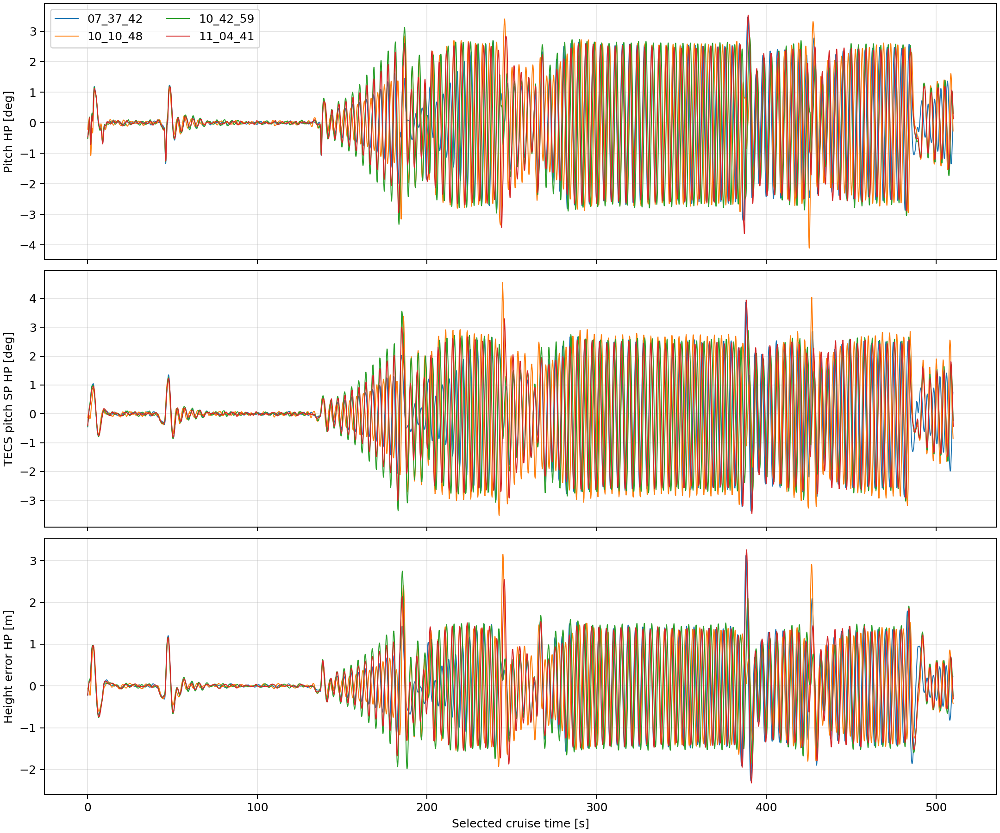
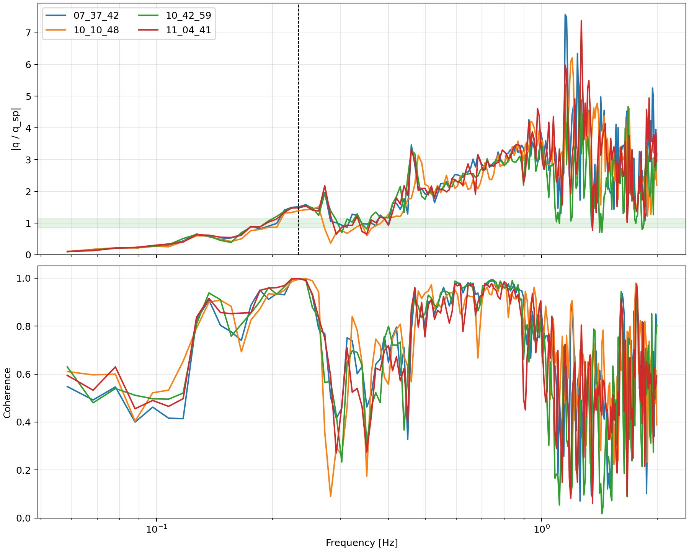
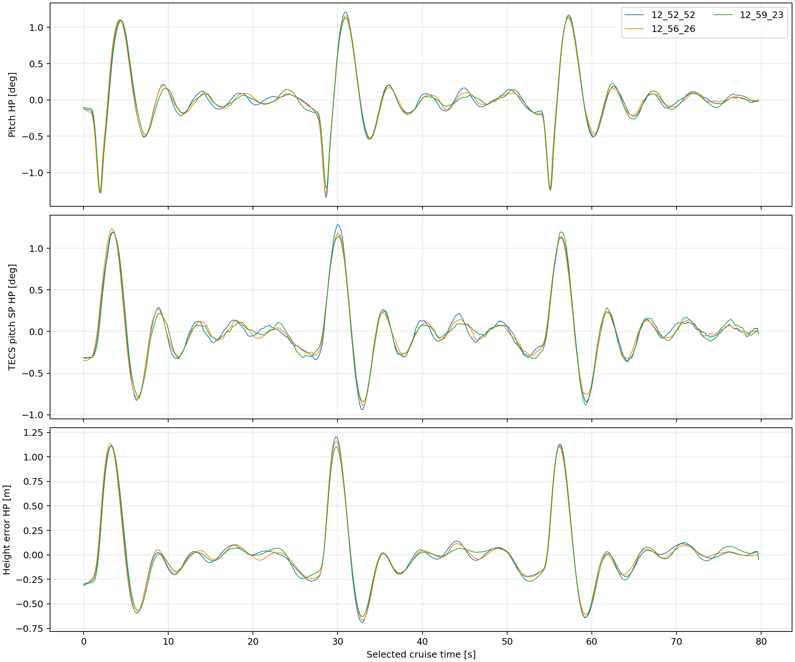
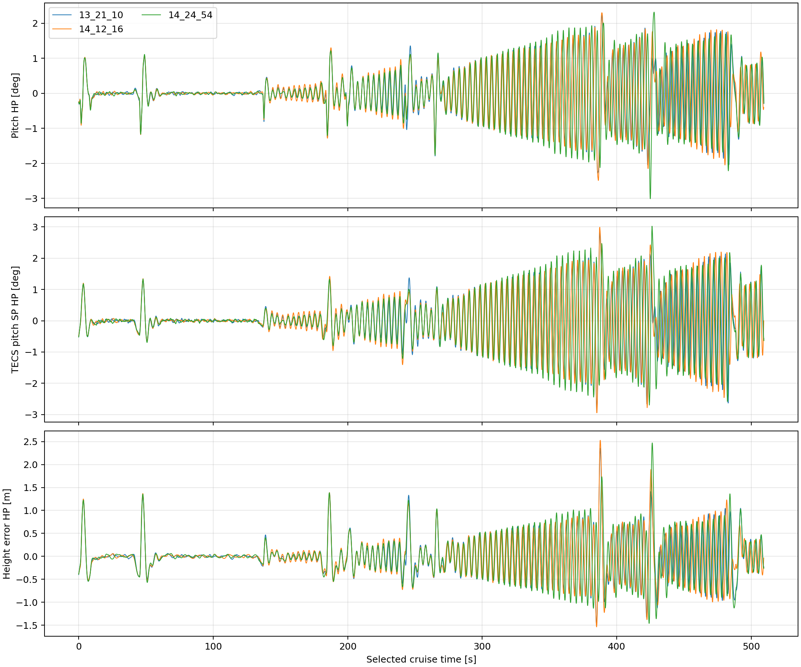
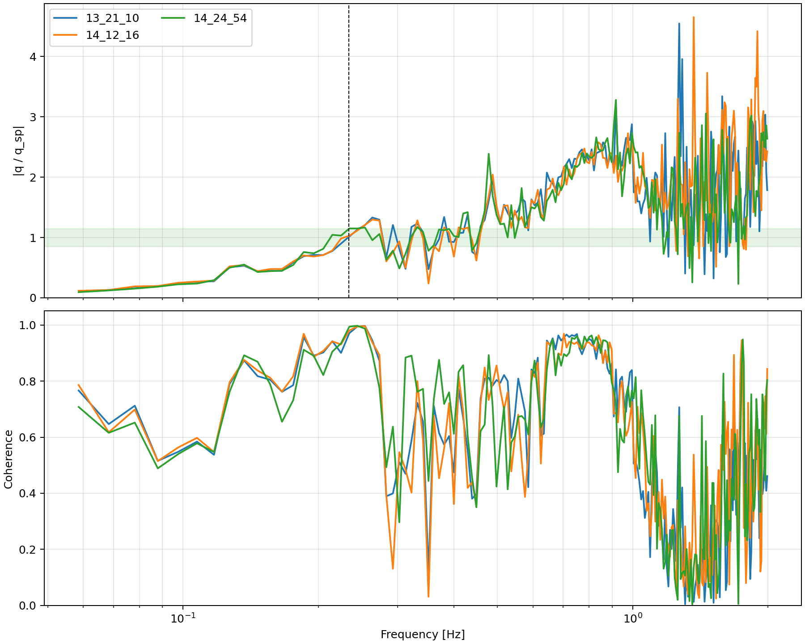

# 鸿鹄翼 V8 100 kg纵向振荡治理与控制器整定报告

> **重要更正（2026-08-05）：本报告原“工程验收通过”结论已撤销。**
> 全程标准差被前半段平稳数据稀释，未识别后半程持续增长的0.24 Hz振荡。
> 请以`HONGHU_V8_100KG_LONGITUDINAL_CONTROL_CORRECTION_2026-08-05.md`为当前结论；
> 本文件仅保留为参数试验和错误验收方法的历史记录。

日期：2026-08-04

适用分支：`variant/honghu-v8-100kg`

代码基线：`2a644a5f1e37ab0357646be26e05ef1df80e744c`

试验机型：`4038_gz_honghu_wing_100kg_v8_xiangyi_test`

## 1. 最终结论

100 kg构型的主要问题并不是气动模型在巡航点静不稳定，而是俯仰率内环在约
0.234 Hz处放大了姿态指令，TECS又持续激励这一低阻尼闭环模态。按“俯仰率内环—
姿态环—TECS”由内到外重新整定后，经典完整航线三次结果为：

| ULog | 俯仰10 s高通标准差 | TECS俯仰指令高通标准差 | 升降舵高通标准差 | 高度误差RMS |
|---|---:|---:|---:|---:|
| `13_21_10.ulg` | 0.680° | 0.801° | 0.333° | 0.570 m |
| `14_12_16.ulg` | 0.695° | 0.822° | 0.342° | 0.587 m |
| `14_24_54.ulg` | 0.738° | 0.866° | 0.334° | 0.609 m |
| 三次均值 | **0.704°** | **0.829°** | **0.336°** | **0.589 m** |

相对基线`07_37_42.ulg`的1.269°俯仰波动和0.940 m高度误差，三次均值分别改善
44.5%和37.4%；升降舵高频活动改善36.9%，俯仰率跟踪RMSE改善约21.5%。用户确认
当前约0.68°量级的结果可以接受，因此本轮**不增加巡航陷波模块**，避免为了约
0.05°的剩余目标差距引入新的阶段切换和滤波状态。

最终方案为纯参数方案，保留俯仰率积分器，不修改气动表、发动机模型、150 kg的4028
机型或V3代码。

## 2. 构型、工况与问题性质

本轮固定使用：

| 项目 | 数值/说明 |
|---|---|
| 总质量 | 100 kg |
| 重心 | `xCG=-1.57 m` |
| 俯仰惯量 | `Iyy=33.9514 kg·m²` |
| 气动模型 | 与150 kg共用V8气动表和实现 |
| 巡航鸭翼 | 约`+6°`，不参与常规俯仰分配 |
| 巡航空速 | 约45 m/s；最终三架次5/50/95百分位约44.0/45.2/46.0 m/s |
| 巡航迎角 | 主要约`-1.0°～+0.3°` |
| 滚转限制 | 25°，本轮纵向整定期间保持不变 |

在这一低迎角工作点，`Cmα<0`，飞机仍为静稳定构型，但局部静稳定裕度约2.5%～
2.8%，小于150 kg较高迎角配平区的局部稳定裕度。质量和惯量下降后，完全沿用150 kg
控制率不能保证相同动态阻尼。

四次旧100 kg完整日志均出现约0.234 Hz纵向峰值。基线在该频率下
“俯仰率指令→真实俯仰率”增益为1.513、相干度0.998，说明内环对指令存在明显放大；
因此不能只在TECS外环继续盲扫参数。





## 3. 新增离线与自动试验工具

### 3.1 纵向日志分析器

文件：`Tools/honghu/analyze_honghu_v8_longitudinal_control.py`

主要功能：

- 同时分析一个或多个ULog，统一重采样到20 Hz；
- 从ULog的`changed_parameters`恢复实际运行参数，避免把启动值误认为试验值；
- 按AGL、任务序号和TAS筛选连续巡航区间；
- 用10 s移动均值高通量化俯仰、TECS指令、升降舵和高度波动；
- 计算Welch功率谱、互谱、闭环增益、相位和相干度；
- 输出JSON、CSV、纵向时序图和频响图。

复现三次最终完整航线：

```bash
python3 Tools/honghu/analyze_honghu_v8_longitudinal_control.py \
  build/px4_sitl_default/rootfs/log/2026-08-04/13_21_10.ulg \
  build/px4_sitl_default/rootfs/log/2026-08-04/14_12_16.ulg \
  build/px4_sitl_default/rootfs/log/2026-08-04/14_24_54.ulg \
  --output-dir analysis_outputs/honghu_v8_100kg_longitudinal_control_2026-08-04/final_three_full_mission_analysis
```

### 3.2 自动俯仰辨识工具

文件：`Tools/honghu/run_honghu_v8_pitch_identification.py`

工具通过正常跑道起飞进入安全空域，然后使用OFFBOARD直接开展俯仰率或俯仰姿态
试验。支持40/45/50 m/s、运行时参数覆盖、双脉冲、多正弦和姿态阶跃，并监视俯仰、
俯仰率、空速、AGL和实际升降舵。参数覆盖只对单次试验生效，结束后恢复。

示例：

```bash
python3 Tools/honghu/run_honghu_v8_pitch_identification.py rate \
  --airspeed 45 \
  --param FW_PR_FF=0.60 --param FW_PR_P=0.90 \
  --param FW_PR_I=0.04 --param FW_PR_D=0.04 \
  --output analysis_outputs/honghu_v8_100kg_longitudinal_control_2026-08-04/rate_45.json
```

40 m/s后期复核中曾发生PX4拒绝进入OFFBOARD、没有`offboard_control_mode`的情况。
工具现已将“实际模式未切换”设为失败，不再把AUTO飞行误判成有效辨识。因此本轮最终
参数在45和50 m/s有直接辨识证据；40 m/s只有早期、缩放口径不同的辅助结果，不能
冒充最终生产缩放下的正式验收数据。

## 4. 由内到外的整定结果

### 4.1 配平与俯仰率内环

`TRIM_PITCH=-0.09`不能在100 kg巡航点承担足够静态舵偏，AUTO状态下非零俯仰率
指令在补偿这一配平误差。最终采用`TRIM_PITCH=-0.125`，并增加PX4官方的空速配平
调度：

```text
FW_DTRIM_P_VMIN = +0.12
FW_DTRIM_P_VMAX = -0.05
```

其作用是抵消PX4随空速平方变化的配平缩放，使40～50 m/s范围内的物理升降舵配平
更一致；剩余未知偏差仍由非零积分器消除。

代表性俯仰率筛选结果：

| 速度 | 参数变化 | 0.244 Hz增益 | 0.15～1.5 Hz峰值 | 判定 |
|---:|---|---:|---:|---|
| 45 m/s | `FF=0.90`（旧趋势） | 1.277 | 1.669 | 拒绝，放大明显 |
| 45 m/s | `FF=0.75` | 1.111 | 1.478 | 拒绝，峰值偏大 |
| 45 m/s | `FF=0.60,P=0.50,D=0.04` | 0.958 | 1.241 | 通过 |
| 50 m/s | `P=0.50`，带配平调度 | 1.338 | 1.380 | 拒绝 |
| 50 m/s | `P=0.70`，带配平调度 | 1.287 | 1.322 | 边界外 |
| 50 m/s | `P=0.90`，带配平调度 | 1.236 | 1.272 | 通过 |
| 45 m/s | 最终`P=0.90`组合 | 1.041 | 1.191 | 通过 |

`FW_PR_D=0.05`已有完整航线退化证据，本轮没有再次选用。最终俯仰率环为：

```text
FW_PR_FF = 0.60
FW_PR_P  = 0.90
FW_PR_I  = 0.04
FW_PR_D  = 0.04
```

积分器始终保留；最终完整航线积分项最大绝对值仅约0.0076，远离0.12限幅。

### 4.2 俯仰姿态环

在通过的内环基础上筛选`FW_P_TC=0.8/1.0/1.2/1.5 s`。对应试验最大俯仰率约为
4.31/3.56/3.04/2.54°/s。更大的时间常数虽然降低瞬时俯仰率，却增大慢速跟踪偏差；
`0.8 s`是满足安全和稳定性条件的最快候选，因此保持：

```text
FW_P_TC = 0.80 s
```

起飞和降落专用俯仰率前馈及限制没有修改。

### 4.3 TECS高度环

内环整定后，经典航线仍有约0.225～0.244 Hz的TECS持续激励。完整经典航线的单因素
结果为：

| 组合 | 俯仰高通标准差 | 高度误差RMS | 结论 |
|---|---:|---:|---|
| `ALT_TC=3.5,DAMP=0.15,I=0.05` | 1.018° | 0.746 m | 内环改善后TECS基准 |
| `ALT_TC=4.5,DAMP=0.15,I=0.05` | **0.680°** | **0.570 m** | 采用 |
| `ALT_TC=4.5,DAMP=0.20,I=0.05` | 0.961° | 0.740 m | 拒绝 |
| `ALT_TC=4.5,DAMP=0.15,I=0.04` | 0.756° | 0.610 m | 拒绝 |
| `ALT_TC=5.0,DAMP=0.15,I=0.05` | 0.698° | 0.609 m | 收益不足15%，拒绝 |

最终TECS参数为：

```text
FW_T_ALT_TC     = 4.5 s
FW_T_PTCH_DAMP  = 0.15
FW_T_I_GAIN_PIT = 0.05
FW_T_RLL2THR    = 20
```

## 5. 中等航线与完整航线复飞

最终内环参数在中等长度无折返航线上连续三次得到：

| 指标 | Run 1 | Run 2 | Run 3 |
|---|---:|---:|---:|
| 俯仰高通标准差 | 0.374° | 0.367° | 0.365° |
| 高度误差RMS | 0.440 m | 0.439 m | 0.431 m |
| 俯仰率跟踪RMSE | 0.662°/s | 0.664°/s | 0.663°/s |



经典完整航线比中等航线包含更多连续转弯和能量变化，因此残余波动略大。三次最终
完整航线的主频均为0.244 Hz，俯仰率指令到真实俯仰率的增益为1.115～1.150、相干度
为0.995～0.997，已经从基线1.513的放大降低至可接受范围。





原计划的严格目标为俯仰高通标准差不超过0.65°。三次完整航线为0.680～0.738°，没有
严格达到该数值；但相对基线改善稳定、没有以降低滚转角或放慢航线换取指标，用户已
接受当前结果。本报告因此将状态记为“工程验收通过，严格研究指标略有余量”，而不是
篡改阈值或宣称完全达到0.65°。

## 6. 起飞、降落和鸭翼回归

使用4038默认参数、真实接地并保留接地后约8 s数据的代表日志为`14_12_16.ulg`：

| 项目 | 结果 |
|---|---:|
| 离地真空速 | 40.33 m/s |
| 起飞真值俯仰峰值 | 5.98° |
| 空中最大滚转角 | 26.15° |
| 空中最大俯仰角 | 8.48° |
| 空中空速范围 | 30.91～46.57 m/s |
| 接地下沉率 | 2.94 m/s |
| 接地后最大滚转/俯仰 | 3.83° / 1.01° |
| 接地后最低真值高度 | -0.000065 m，未穿地 |
| 空中鸭翼 | +6.000°附近 |
| 接地后鸭翼 | 完成收回、延时并到达−50°，保持超过2 s |

该架次完成任务第18项并真实接地。自动验收工具唯一的`FAIL`来自其通用
“接地下沉率<1 m/s”阈值；本轮计划已明确把既有约3.4 m/s接地下沉率作为独立遗留
问题，只要求不得恶化超过0.2 m/s。2.94 m/s没有恶化，因此不构成本轮纵向巡航方案
的失败。

## 7. 最终写入4038的100 kg专用参数

```text
FW_PR_FF          = 0.60
FW_PR_P           = 0.90
FW_PR_I           = 0.04
FW_PR_D           = 0.04
FW_P_TC           = 0.80
TRIM_PITCH        = -0.125
FW_DTRIM_P_VMIN   = +0.12
FW_DTRIM_P_VMAX   = -0.05
FW_R_LIM          = 25 deg
FW_T_ALT_TC       = 4.5 s
FW_T_PTCH_DAMP    = 0.15
FW_T_I_GAIN_PIT   = 0.05
```

没有加入任何`FW_P_CR_*`陷波参数或C++滤波代码。

## 8. 文件、结果与隔离性

- 100 kg机型参数：`ROMFS/px4fmu_common/init.d-posix/airframes/4038_gz_honghu_wing_100kg_v8_xiangyi_test`
- 分析工具：`Tools/honghu/analyze_honghu_v8_longitudinal_control.py`
- 辨识工具：`Tools/honghu/run_honghu_v8_pitch_identification.py`
- 全部试验产物：`analysis_outputs/honghu_v8_100kg_longitudinal_control_2026-08-04/`
- 150 kg机型哈希：`7f990a3c88c9b1c1f435c2b457d1201896223041840355d719a8f27076de3963`
- 150 kg SDF哈希：`621fe15b0d2956b5384ab66b83841678d61575af8deeb0f74d5208471c5ba035`
- V3机型哈希：`eebba52e0c552a8e1678f795d4ba9b3fcf3750e41df08aeda1f3d29457955daa`

上述三个受保护文件的哈希与试验前一致。编译使用：

```bash
CCACHE_TEMPDIR=/tmp/ccache-tmp make px4_sitl_default
```

编译通过；`git diff --check`、两个Python工具的`py_compile`和命令行帮助检查均通过。

## 9. 后续边界

1. 当前参数可作为100 kg稳定基线；后续试验应继续只在100 kg worktree和4038中开展。
2. 若未来重新要求严格低于0.65°，应重新收集至少三次完整航线后再评估巡航陷波，
   而不是继续盲目增加TECS阻尼或降低滚转角。
3. 40 m/s最终缩放口径下的直接OFFBOARD辨识仍缺一组有效重复试验，可作为低优先级
   补充证据，但现有完整起飞、45/50 m/s辨识和三次任务回归足以支持当前工程基线。
4. 接地下沉率应在独立LAND/拉平专题中处理，不应通过巡航控制参数反向补偿。
