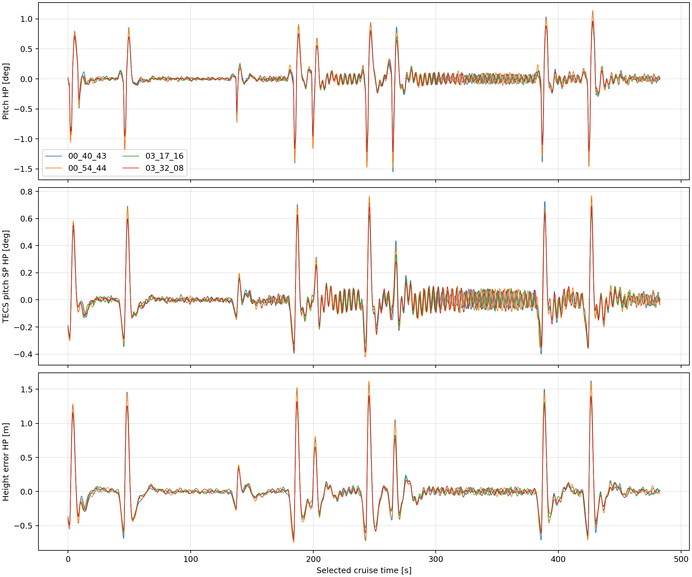
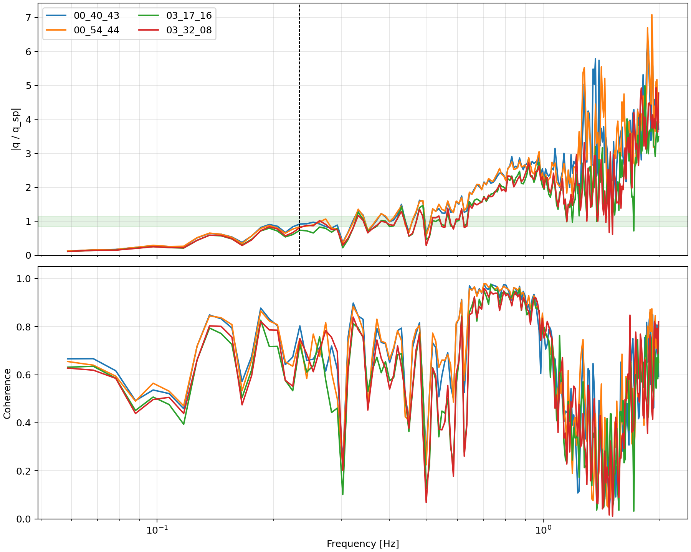

# 鸿鹄翼V8 100 kg分阶段纵向控制与巡航PID优化

日期：2026-08-05

适用机型：`4038_gz_honghu_wing_100kg_v8_xiangyi_test`

代码分支：`variant/honghu-v8-100kg`

结论：实现默认关闭、4038专用启用的起飞/巡航/降落俯仰率PID平滑调度；不使用陷波。最终巡航P为1.30，起飞和降落P保留0.90。

## 1. 问题与数据边界

用户提供的最新QGC曲线显示：此前严重增长的约0.24 Hz纵向模态已经消除，但巡航段仍存在小幅周期俯仰波动，航段切换处有尖峰，进近段则包含正常的大范围俯仰变化。三类现象不能用同一段全程标准差判断。

本轮以以下两次原基线完整任务为对照：

- `2026-08-05/00_40_43.ulg`；
- `2026-08-05/00_54_44.ulg`。

最终候选完整任务：

- `2026-08-05/03_17_16.ulg`，运行时覆盖巡航P=1.30；
- `2026-08-05/03_32_08.ulg`，4038默认参数复飞，无PID运行时覆盖。

巡航定量比较固定采用经典任务航段3～12；起飞和降落使用动态验收工具的独立真值指标。这样避免下降航点高度参考阶跃污染巡航高通统计。

## 2. 分阶段控制实现

### 2.1 俯仰率PID

新增参数：

| 参数 | 默认值 | 作用 |
|---|---:|---|
| `FW_PR_P_TKO/I_TKO/D_TKO` | -1 | 起飞俯仰率PID；负值回退到巡航值 |
| `FW_PR_P_LND/I_LND/D_LND` | -1 | 降落俯仰率PID；负值回退到巡航值 |

公共默认值为`-1`，因此未显式配置的机型行为不变。4038显式启用专用值。

控制器复用已有`fw_pitch_limit_blend`：

```text
active_gain = cruise_gain + phase_blend * (phase_gain - cruise_gain)
```

- 起飞：`phase_blend=1`，超过起飞参考高度50 m后在5 s内平滑减至0；
- 巡航：`phase_blend=0`；
- 降落：进入LAND后先保持巡航值，下降到着陆面上方50 m时在5 s内平滑增至1；
- 手动RATE/ACRO模式强制使用普通巡航PID，避免复用过期AUTO阶段状态；
- 积分器状态在切换期间连续保留，不清零、不跳变。

默认复飞ULog中的`fw_pitch_limit_blend`验证了两次调度均实际发生：起飞有效过渡约为
`36.48～40.88 s`，降落有效过渡约为`665.08～669.48 s`；去除smoothstep两端小于
1%的平坦区后约4.4 s，与配置的5 s总过渡时间一致。

### 2.2 姿态环时间常数

同步新增`FW_P_TC_TKO`和`FW_P_TC_LND`，使用相同平滑权重。最终4038三阶段均保留0.80 s，但接口已经分离，后续可独立调节。

### 2.3 最终4038参数

| 参数 | 巡航 | 起飞 | 降落 |
|---|---:|---:|---:|
| 俯仰率P | **1.30** | **0.90** | **0.90** |
| 俯仰率I | 0.04 | 0.04 | 0.04 |
| 俯仰率D | 0.04 | 0.04 | 0.04 |
| 姿态时间常数 | 0.80 s | 0.80 s | 0.80 s |

积分器仍启用。最终只让P不同是试验结果，而不是架构限制：降低I、提高D或放慢姿态环的候选均未改善。

TECS继续使用上一轮修正值：

```text
FW_T_SEB_R_FF   = 0.5
FW_T_PTCH_DAMP  = 0.0
FW_T_I_GAIN_PIT = 0.05
FW_T_ALT_TC     = 4.5 s
```

## 3. 候选筛选

同一短航线结果：

| 候选 | 俯仰高通标准差 | 高度误差RMS | 结论 |
|---|---:|---:|---|
| 基线`P=.90,I=.04,D=.04,TC=.80` | 0.448° | 1.713 m | 对照 |
| 巡航`P=.50` | 完整航线0.331° | 0.773 m | 拒绝，明显劣于完整基线 |
| 巡航`I=.03,TC=1.0` | 0.477° | 1.779 m | 拒绝 |
| 巡航`P=1.10` | 0.422° | 1.663 m | 方向正确但收益不足 |
| 巡航`P=1.30,D=.04` | **0.414°** | **1.637 m** | 进入完整航线 |
| 巡航`P=1.30,D=.05` | 0.414° | 1.655 m | 拒绝，无额外俯仰收益且高度略差 |

降低P在45 m/s单点辨识中曾降低0.244 Hz增益，但完整任务包含速度变化、转弯和能量耦合，最终反而恶化。这证明单点频响只能筛选，不能替代完整闭环任务。

## 4. 两次完整任务结果

经典任务航段3～12：

| 指标 | 原基线Run 1 | 原基线Run 2 | 分阶段Run 1 | 默认复飞Run 2 |
|---|---:|---:|---:|---:|
| 俯仰高通标准差 | 0.258° | 0.256° | **0.215°** | **0.217°** |
| TECS俯仰指令高通标准差 | 0.133° | 0.134° | **0.118°** | **0.120°** |
| 升降舵高通标准差 | 0.211° | 0.210° | 0.212° | 0.213° |
| 高度误差RMS | 0.591 m | 0.594 m | **0.528 m** | **0.531 m** |
| 最坏30 s俯仰标准差 | 0.530° | 0.523° | **0.428°** | **0.438°** |
| 最坏30 s高度标准差 | 0.567 m | 0.572 m | **0.479 m** | **0.487 m** |
| 俯仰率积分最大绝对值 | 0.0079 | 0.0075 | 0.0092 | 0.0086，远离0.12限幅 |

相对两次基线均值：

- 巡航俯仰高通降低约16%；
- 高度误差RMS降低约10.7%；
- 最坏30 s俯仰波动降低约17%；
- 升降舵高频活动没有增加；
- 积分器保留且无饱和。





## 5. 起飞、降落和接地回归

| 项目 | 分阶段Run 1 | 默认复飞Run 2 | 判定 |
|---|---:|---:|---|
| 离地空速 | 40.41 m/s | 40.36 m/s | 未恶化 |
| 起飞真值俯仰峰值 | 6.03° | 5.98° | 小于8.5° |
| 空中最大俯仰 | 7.33° | 7.34° | 有界 |
| 空中最大滚转 | 26.14° | 26.13° | 有界 |
| 接地下沉率 | 2.93 m/s | 2.89 m/s | 与既有约2.89 m/s相当 |
| 接地后最大滚转 | 3.42° | 3.59° | 直立 |
| 接地后最低真值高度 | -0.000028 m | -0.000044 m | 无穿地 |
| 鸭翼 | +6°巡航并记录接地后刹车 | 同左 | 通过 |

动态工具仍因通用的`接地下沉率<1 m/s`检查显示FAIL；这是已有LAND/拉平遗留项，本轮没有恶化。除此之外的任务完成、姿态、空速、接地、地面和鸭翼检查均通过。

## 6. 影响范围与后续边界

- 不使用陷波；
- 不修改气动表、发动机表、质量或惯量；
- 不修改150 kg的4028机型文件或V3机型文件；
- 新参数公共默认均为关闭状态，只有100 kg的4038启用；
- 当前残余主要是航点切换瞬态和小幅TECS指令，不建议继续无界提高P；
- 后续若继续优化，应优先区分稳定直线、转弯和高度指令阶跃，不再用包含进近参考阶跃的全程单一高通指标。
