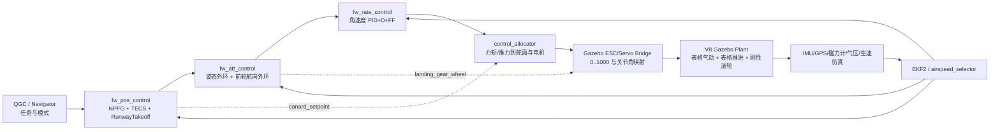

# 鸿鹄翼 V8 整体架构、实现说明与 V3 控制对比

> 文档日期：2026-07-19
> 代码仓库：`/home/fly/PX4-Autopilot-canard-2026.6.2`
> V8 启动目标：`make px4_sitl gz_honghu_wing_150kg_v8`
> V8 机型编号：`SYS_AUTOSTART=4028`
> V3 机型编号：`SYS_AUTOSTART=4024`

## 1. 文档目的和结论摘要

本文按照当前工作区中的实际代码，对鸿鹄翼 V8 的模型、飞控链路、控制参数和 V3/V8 差异进行统一说明。PDF 和既有参考文档只用于解释数据来源与项目背景；当文档描述与当前代码不一致时，以当前代码为准。

先给出最重要的结论：

1. **V8 没有重写 PX4 的空中飞控架构。** 空中任务导航仍是 Navigator + 固定翼位置控制器，横向仍由 NPFG 产生滚转设定，纵向仍由 TECS 产生俯仰和油门设定，之后仍经过姿态外环、角速度内环、控制分配器和 Gazebo 输出桥。
2. **V8 与 V3 的最大差异首先是被控对象，而不是控制器类型。** V8 使用独立六分量表格气动、独立表格发动机、质心统一的质量惯量、真实滚动轮和可转向前轮；V3 使用 Gazebo `AdvancedLiftDrag` 线性气动、`MulticopterMotorModel` 近似推力和滑块式地面接触。
3. **V8 的空中控制改善主要来自重新整定参数。** 当前 4028 明确写入了俯仰/滚转姿态环、角速度 PID+FF、TECS、NPFG、滚转角和角速度限制等参数。V3 的 4024 大部分沿用 PX4 默认值或参数文件中的历史值。
4. **V8 确实增加了少量共享控制源码。** 主要是跑道方向选择、地面航线和前轮闭环、起飞后短时保留轮控、跑道抬头前馈释放、着陆状态判定以及 Gazebo 桥接时序；这些不是一套新的空中导航或飞行控制律。
5. **V8 的鸭翼控制逻辑与 V3 同源。** 鸭翼由独立状态机控制，在跑道起飞进入 `CLIMBOUT` 后展开并在空中保持约 `+4 deg`，不参与常规俯仰力矩分配。4028 默认关闭手动鸭翼和自动鸭翼配平，因此当前正式 V8 不用鸭翼跟踪瞬时俯仰指令。
6. **当前 NPFG 的“圆弧感”不是几何圆弧航迹规划。** `NPFG_PERIOD=20 s` 使直线段切换过程更平滑，但 PX4 仍在跟踪任务直线段及其延长线。精确的定半径航点过渡仍需显式生成圆弧/航迹点，不能只靠 `NAV_ACC_RAD`。
7. **V3/V8 对比必须说明代码基线。** 当前 V3 和 V8 共用同一套已修改 PX4 可执行文件。因此今天启动 V3 时，它也会继承共享源码中的通用修改；只有模型 SDF、4024/4028 机型参数和按 V8 名称启用的桥接分支不同。本文同时给出“V3 时代 HEAD 基线”和“当前工作区运行 V3”两个层次，避免误判。

## 2. 比较基线、来源和可信度

### 2.1 当前代码状态

当前仓库位于 `main`，检查时 `HEAD=2911fad518`。V8 模型、4028 机型文件、测试工具及多项共享源码改动仍处于未提交或工作区修改状态。因此：

- 本文是对 **2026-07-19 当前工作区快照** 的说明，而不是某个可由单一 Git commit 完整恢复的发布版本。
- 如果后续清理、提交或切换分支，应重新核对本文中的文件和参数。
- 不应只用 `git show HEAD` 判断 V8；V8 的大量实际实现不在 HEAD 中。

### 2.2 信息优先级

本文采用以下优先级：

1. 当前 C++、Shell、SDF、CSV 和测试脚本；
2. 当前动态验收 JSON 和 ULog 结论；
3. `data_provenance.yaml` 与模型 README；
4. 项目综合参考文档、控制差异文档和历史聊天结论；
5. PDF 中的原始参数。

PDF 是气动、推进和质量几何数据的重要来源，但它不是控制软件架构说明，也不能证明某个实现已经在代码中生效。

### 2.3 V3 的三个含义

项目中“V3”可能指三种不同基线：

| 基线 | 含义 | 适用场景 |
|---|---|---|
| V3 模型 | 当前 `honghu_wing_150kg_v3/model.sdf` | 比较被控对象、地面接触、气动和发动机 |
| 4024 机型 | 当前 `4024_gz_honghu_wing_150kg_v3` | 比较启动参数、通道和鸭翼标定 |
| V3 时代源码 | 当前仓库 HEAD 中已经提交的控制源码 | 判断哪些源码能力原本已存在、哪些是 V8 阶段新增 |

如果现在运行 `make px4_sitl gz_honghu_wing_150kg_v3`，它会编译当前共享源码，而不是自动回退到 V3 时代源码。因此“当前 V3 运行结果”不等于“历史 V3 运行结果”。

## 3. V8 系统组织架构

### 3.1 顶层闭环



这张图包含三条性质不同的控制通道：

- 常规飞行通道：滚转、俯仰、偏航力矩和推力；
- 鸭翼辅助通道：状态机设定直接叠加到 CS6/CS7，不进入三轴力矩矩阵；
- 前轮通道：单独的 `landing_gear_wheel` 输出到 Gazebo `servo_8`，不是方向舵气动力通道。

### 3.2 主要文件组织

| 层次 | 主要文件/目录 | 作用 |
|---|---|---|
| V8 机型入口 | `ROMFS/px4fmu_common/init.d-posix/airframes/4028_gz_honghu_wing_150kg_v8` | 环境、飞控参数、控制分配、执行器映射 |
| V8 模型 | `simulation_models/models/honghu_wing_150kg_v8/model.sdf` | 刚体、舵面、轮子、传感器、插件配置 |
| V8 世界 | `Tools/simulation/gz/worlds/honghu_v8.sdf` | 地面、物理后端、WGS84 原点 |
| V8 气动 | `src/modules/simulation/gz_plugins/honghu_v8/HonghuAeroV8.cpp` | 六分量表格气动与总气动力/矩 |
| V8 推进 | `src/modules/simulation/gz_plugins/honghu_v8/HonghuPropulsionV8.cpp` | 表格推力、转速、扭矩和燃油率 |
| 通用表格支持 | `HonghuV8Common.cpp/.hpp` | CSV 二维/三维插值和路径解析 |
| 气动数据 | `simulation_models/models/honghu_wing_150kg_v8/aero_tables/` | 静态六系数及四类舵效表 |
| 推进数据 | `simulation_models/models/honghu_wing_150kg_v8/propulsion_tables/` | `propeller.csv`、`fuel.csv` |
| 数据来源 | `simulation_models/models/honghu_wing_150kg_v8/data_provenance.yaml` | 原始、推导和工程假设分层 |
| 模型生成 | `Tools/honghu/generate_honghu_v8_model.py` | 质量惯量闭合和 SDF 生成 |
| 静态验收 | `Tools/honghu/check_honghu_v8.py` | 坐标、质量、符号、表格、接口检查 |
| 动态验收 | `Tools/honghu/run_honghu_v8_dynamic_acceptance.py` | 滑跑、起飞、航线和盘旋闭环测试 |

## 4. V8 模型的组织与具体实现

### 4.1 坐标系和参考点

V8 对坐标进行了显式统一：

- PDF 和 PX4 机体系：FRD，`X` 前、`Y` 右、`Z` 下；
- Gazebo 模型局部系：FLU，`X` 前、`Y` 左、`Z` 上；
- Gazebo 世界系：ENU；
- FRD 与 FLU 的向量转换：`R = diag(1,-1,-1)`。

力和力矩都必须使用同一个转换：

```text
F_GZ = (Fx_FRD, -Fy_FRD, -Fz_FRD)
M_GZ = (Mx_FRD, -My_FRD, -Mz_FRD)
```

PDF 气动力矩先在 FRD 下形成：

```text
M_FRD = qbar * S * [b*Cl, cbar*Cm, b*Cn]
```

之后只转换一次到 Gazebo。因而 FRD 正俯仰、正偏航系数，在 Gazebo 中分别表现为负 `Y`、负 `Z` 力矩。

`base_link` 原点被定义为组装后整机质心和气动力矩参考点。PDF/CAD 鼻尖原点的点坐标通过以下公式转为 V8 局部坐标：

```text
p_GZ = (x_PDF + 1.57, -y_PDF, -z_PDF)
```

可视网格仍使用旧 CAD 网格，但统一平移 `+1.57 m`；视觉原点不再承担动力学参考点的职责。

### 4.2 质量、质心和惯量

V8 的组装目标为：

| 参数 | 数值 |
|---|---:|
| 总质量 | `150 kg` |
| 参考面积 `S` | `2.42 m²` |
| 翼展 `b` | `3.96 m` |
| 平均气动弦长 `cbar` | `0.62 m` |
| PDF 质心位置 | `xCG=-1.57 m`，已变换为 `base_link` 原点 |

PDF/FRD 惯量为：

```text
Ixx = 25.86, Iyy = 39.14, Izz = 59.12 kg·m²
Ixy = -0.017, Ixz = -3.520, Iyz = -0.0019 kg·m²
```

转换到 Gazebo/FLU 后，目标交叉惯量为：

```text
Ixy = +0.017, Ixz = +3.520, Iyz = -0.0019 kg·m²
```

V8 没有简单地把整机目标惯量直接写入主链接。生成器会先把舵面、轮子和前轮叉的质量、局部惯量及平行轴贡献扣除，再反算 `base_link` 自身属性：

```text
base_link mass = 149.16 kg
base_link inertial pose = (-0.00135832395, 0, +0.00161090373) m
base_link inertia:
  Ixx=25.3996217758, Iyy=38.5152185909, Izz=58.3130652536
  Ixy=+0.017, Ixz=+3.47710415849, Iyz=-0.0019
```

子链接质量为：

| 子系统 | 单件质量 | 数量 | 合计 |
|---|---:|---:|---:|
| 副翼 | `0.02 kg` | 2 | `0.04 kg` |
| 升降舵 | `0.02 kg` | 2 | `0.04 kg` |
| 方向舵 | `0.01 kg` | 2 | `0.02 kg` |
| 鸭翼 | `0.07 kg` | 2 | `0.14 kg` |
| 主轮 | `0.20 kg` | 2 | `0.40 kg` |
| 前轮转向叉 | `0.05 kg` | 1 | `0.05 kg` |
| 前轮 | `0.15 kg` | 1 | `0.15 kg` |

`149.16 + 0.24 + 0.60 = 150.00 kg`。静态检查同时验证组装质心一阶矩为零，而不只是总质量相等。

这与 V3 的关键区别是：V3 虽然各链接质量也恰好合计约 `150 kg`，但主链接直接持有完整目标惯量，子链接的惯量和平行轴贡献会继续叠加；同时 V3 将 FRD 交叉惯量符号直接写入 FLU SDF。V8 才真正闭合了组装后的惯量和坐标约定。

### 4.3 舵面几何、关节角和 PDF 虚拟舵偏

V8 有 8 个真实转动舵面关节：

| Gazebo 关节 | 舵面 | 机械范围 |
|---|---|---:|
| `servo_0/1` | 左/右副翼 | `±30 deg` |
| `servo_2/3` | 左/右升降舵 | `±30 deg` |
| `servo_4/5` | 左/右方向舵 | `±30 deg` |
| `servo_6/7` | 左/右鸭翼 | `-50 .. +15 deg` |

Gazebo 正关节角的几何定义为：

- 副翼、升降舵：后缘向上；
- 方向舵：后缘向飞机右侧；
- 鸭翼：后缘向下。

气动插件不直接把单个关节角当作 PDF 舵偏，而是计算四个虚拟舵偏，单位均为度：

```text
delta_a_doc = 0.5 * (-theta_left_aileron + theta_right_aileron)
delta_e_doc = 0.5 * ( theta_left_elevator + theta_right_elevator)
delta_r_doc = 0.5 * ( theta_left_rudder   + theta_right_rudder)
delta_c_doc = 0.5 * ( theta_left_canard   + theta_right_canard)
```

正 `delta_a/e/r/c` 分别应产生 FRD 正 `Cl/Cm/Cn/Cm`。这条“由实际关节角到实际力矩”的契约比只检查 PWM 或控制分配符号更可靠。

### 4.4 气动力模型

#### 4.4.1 实现类型

V8 使用独立的整机六分量插件 `HonghuAeroV8`。它不调用 V3 的 `AdvancedLiftDrag`，也不复用 V7 的气动力计算公式。

当前模型是 **整机集中气动模型**：插件计算全机合力和关于质心的合力矩，然后一次性向 `base_link` 施加 `AddWorldWrench`。舵面有真实可视和转动关节，但气动力并不是分别作用在各舵面或分布在机翼多个站位上。

#### 4.4.2 相对气流和气动角

插件获取 `base_link` 世界线速度并减去世界风速，转入机体 FLU 后再转入 FRD：

```text
alpha = atan2(w, u)
beta  = atan2(v, sqrt(u²+w²))
```

空气密度采用 `-500 .. 11000 m` 范围内的简化 ISA 关系，不再固定为海平面 `1.225 kg/m³`。

#### 4.4.3 静态六分量系数

静态表包括：

```text
CL.csv, CD.csv, CY.csv, Cl.csv, Cm.csv, Cn.csv
```

其中：

- `CL/CD/Cm` 对侧滑角采用偶对称；
- `CY/Cl/Cn` 对侧滑角采用奇对称；
- 二维表使用双线性插值；
- `|beta| > 16 deg` 时钳位到表边界并置位诊断标志；
- PDF 缺少的 `alpha=18/20 deg` 非零侧滑数据由 `alpha=16 deg` 的侧滑增量形状推导，使用时置位 `derived static data` 标志；
- 正失速 `alpha>20 deg` 和推导的负失速 `alpha<-12 deg` 使用连续 Viterna 扩展；侧向系数在大迎角逐步衰减。

#### 4.4.4 舵效表

舵效表分为副翼、升降舵、方向舵和鸭翼。当前代码将 PDF 表值解释为局部“每度导数”：

```text
Delta Ci = Di(alpha, beta, delta_doc) * delta_doc_deg
```

所以零舵偏时总舵效严格为零，但导数表在零偏附近不需要人为改成零。

具体边界处理为：

- 副翼：查表舵偏限制在 `±10 deg`，但乘实际有符号舵偏；大迎角 `12 .. 20 deg` 逐步衰减；
- 升降舵：在 `-10 .. +20 deg` 内查导数，超出时保持边界导数并乘实际舵偏；
- 方向舵：根据负舵偏对侧滑角做反射对称，表外输入钳位并置位标志；
- 鸭翼：`-4 .. +8 deg` 为主要数据区，`+8 .. +15 deg` 有界外推；小于 `-4 deg` 时冻结为 `-4 deg` 的有效气动贡献，避免将机械 `-50 deg` 气动刹车位置线性放大为非物理力矩。

#### 4.4.5 动导数

当前动态导数为：

```text
CLq = +5.62
CYp = -0.15, CYr = +0.34
Clp = -0.33, Clr = +0.10
Cmq = -7.00, Cm_alpha_dot = -0.33
Cnp = -0.05, Cnr = -0.08, Cn_beta_dot = +0.14
```

它们分别乘无量纲化的 `p/q/r` 和实际计算的 `alpha_dot/beta_dot`。这修正了早期尝试中把 `Cm_alpha_dot/Cn_beta_dot` 错乘 `alpha/beta` 的问题。

低速保护包括：

- 小于 `3 m/s` 时重置迎角/侧滑角导数；
- `3 .. 5 m/s` 平滑启用动导数；
- 角度导数使用 `0.05 s` 一阶滤波，并限制原始变化率。

#### 4.4.6 力和力矩施加

动压 `qbar=0.5*rho*V²`。插件先在 FRD 的风轴/机体系组合中构造阻力、侧力和升力，再得到：

```text
M_FRD = [Cl*qbar*S*b, Cm*qbar*S*cbar, Cn*qbar*S*b]
```

之后统一转为 FLU 和世界系，对 `base_link` 施加整机 wrench。

### 4.5 发动机模型

V8 的 `HonghuPropulsionV8` 是模型中的唯一推力源。它通过 Gazebo ESC 桥接的模型作用域话题接收 `0 .. 1000` 指令：

```text
/model/<runtime-model-name>/honghu_v8/motor_command
```

插件按照高度、滤波后油门和空速插值：

- 推力，PDF 中的 `kgf` 在载入表格时换算为 `N`；
- 螺旋桨 RPM；
- 轴扭矩；
- 燃油率。

油门状态不是瞬时变化：

```text
tau_up   = 0.5 s
tau_down = 0.3 s
```

发动机点和推力方向为：

```text
r_engine_GZ = (-1.23, 0, +0.12) m
d_thrust_GZ = [cos(3 deg), 0, -sin(3 deg)]
```

这说明代码中已经实现文档所述的 **向下 3° 推力线**。它既产生向下的推力分量，也通过 `r × F` 产生关于质心的俯仰力矩。插件还把表中螺旋桨轴扭矩以相反符号作为机体反扭矩施加；当前前视逆时针桨对应机体 `-X` 反扭矩。

首版质量保持 `150 kg` 不变。燃油率只用于诊断，不实时改变总质量、质心或惯量。

### 4.6 起落架、轮胎和地面模型

当前 V8 采用“刚性支柱 + 真实滚动轮”，而不是“无轮滑块”，也不是复杂悬架：

- 两个主轮通过自由转动的 revolute joint 直接连接 `base_link`；
- 前轮由一个绕 `Z` 轴的转向叉关节和一个自由滚动关节组成；
- 没有 prismatic joint、弹簧行程或悬架阻尼状态；
- 机腹另有低摩擦保护碰撞体，只用于异常姿态触地保护。

轮心位置：

```text
left main  = (-0.291274, +0.524303, -0.4551) m
right main = (-0.291274, -0.524303, -0.4551) m
nose       = (+0.924852, 0, -0.4706) m
```

接触参数：

| 部位 | `mu` | `mu2` | 说明 |
|---|---:|---:|---|
| 主轮 | `0.8` | `2.0` | 自由纵向滚动、较强横向抓地 |
| 前轮 | `1.2` | `3.0` | 提供更强的转向侧向力 |

三轮统一使用：

```text
kp=2e6 N/m, kd=2e4 N·s/m
max_vel=0.2 m/s, min_depth=0.5 mm
```

当前设计选择是先闭合可重复的刚性滚轮基线，再决定是否增加悬架。已有测试表明，早期小步长异常主要与 PX4/Gazebo 消息积压有关，不能简单归因于“没有悬架”。

V8 专用世界使用 DART，SDF 中名义步长为 `4 ms`，但 4028 启动脚本在运行时覆盖为已验证的 `2 ms/500 Hz`。地面平面为 `30000 m × 30000 m`；飞出有限地面范围后下落不能解释为飞控或起落架失效。

### 4.7 地理原点、初始位姿和任务方向

V8 世界及 4028 均指定：

```text
latitude  = 28.5712315 deg
longitude = 121.5759172 deg
altitude  = 0 m
```

启动脚本还会在 Gazebo 世界已经存在时调用 `set_spherical_coordinates`，防止旧 world 实例沿用旧经纬度。

正式机型默认初始位姿为：

```text
PX4_GZ_MODEL_POSE=0,0,0.5145,0,0,1.1349764
```

其中 Gazebo ENU yaw `1.1349764 rad = 65.03 deg`，对应真航向约 `24.97 deg`。这用于对齐当前生产 QGC 航线的起飞方向。动态验收工具会按其自建航线覆盖该位姿。

### 4.8 传感器、估计器和仿真时序

V8 SDF 直接定义：

| 传感器 | 更新率 |
|---|---:|
| IMU | `250 Hz` |
| 磁力计 | `100 Hz` |
| 气压计 | `50 Hz` |
| NavSat/GPS | `30 Hz` |

当前 `model.sdf` 没有独立 `airspeed_link`。空速由 PX4 启动脚本中的 `sensor_airspeed_sim` 提供；Gazebo bridge 仍保留对原生 Gazebo air-speed 话题的订阅接口。这一点应与“模型 SDF 自带空速管”区分开。

V8 名称分支还对 Gazebo bridge 做了时序保护：

- world pose 订阅限制到 `250 Hz`；
- PX4 仿真时钟按仿真时间以 `2 ms` 间隔更新，拒绝重复或回退时间；
- IMU、GPS、磁力计、气压计和 Gazebo 原生空速消息优先使用消息头中的采样时间；
- 目的是避免高频物理消息积压后，控制器使用越来越旧的位姿和传感器状态。

这些是仿真基础设施改动，不是飞行控制律。

### 4.9 诊断接口

V8 气动诊断：

```text
/model/<name>/honghu_v8/aero_state
/model/<name>/honghu_v8/force_frd
/model/<name>/honghu_v8/moment_frd
/model/<name>/honghu_v8/force_gz_flu
/model/<name>/honghu_v8/moment_gz_flu
```

`aero_state` 包含空速、`alpha/beta`、空气密度、`alpha_dot/beta_dot`、FRD `p/q/r`、六个总系数、8 个实际关节角、4 个 `delta_doc`、四类舵面的六系数贡献、8 个关节轴和越界标志。

推进诊断：

```text
/model/<name>/honghu_v8/propulsion_state
```

依次包含目标油门、滤波油门、高度、空速、RPM、推力、扭矩、燃油率和表格/指令状态标志。

## 5. V8 飞控逻辑、控制率和执行器组织

### 5.1 任务与位置控制层

QGC 上传任务后，Navigator 发布当前位置前后航点构成的 `position_setpoint_triplet`。`fw_pos_control` 根据模式调用相应分支。

空中自动航线的横向控制仍由标准 PX4 NPFG 完成：

```text
当前位置、地速、风估计、当前/下一航段
    -> NPFG 路径误差和航迹角控制
    -> roll attitude setpoint
```

纵向仍由 TECS 完成：

```text
高度/垂向速度 + 空速/加速度 + 性能限制
    -> pitch attitude setpoint
    -> throttle setpoint
```

V8 没有单独实现一个定半径圆弧规划器。当前 `NPFG_PERIOD=20 s` 让路径捕获和航段切换表现得更平滑、更像圆弧，但目标路径仍是 PX4 的直线/盘旋原语。

当前主要导航参数：

| 参数 | V8 值 | 作用 |
|---|---:|---|
| `NPFG_PERIOD` | `20 s` | 横向制导响应尺度；较大时转弯更平顺 |
| `NPFG_DAMPING` | `0.80` | 横向过渡阻尼 |
| `NPFG_ROLL_TC` | `1.30 s` | NPFG 使用的飞机滚转响应模型 |
| `NPFG_SW_DST_MLT` | `0.32` | 航段切换距离比例 |
| `NAV_ACC_RAD` | `250 m` | 任务航点接受半径下限，不等于圆弧半径 |
| `FW_R_LIM` | `30 deg` | NPFG 最终滚转设定上限 |
| `FW_PN_R_SLEW_MAX` | `20 deg/s` | NPFG 滚转设定变化率上限 |

### 5.2 TECS 与高度/速度控制

V8 保留 TECS 原有的总能量/能量分配结构，没有单独设计高度 PID。当前关键值为：

| 参数 | V8 值 | 设计意图 |
|---|---:|---|
| `FW_AIRSPD_MIN/TRIM/MAX` | `32/40/55 m/s` | 避免在模型可控速度以下长期工作 |
| `FW_TKO_AIRSPD` | `40 m/s` | 起飞爬升目标空速 |
| `FW_T_ALT_TC` | `3.5 s` | 高度响应时间常数 |
| `FW_T_I_GAIN_PIT` | `0.05` | 保留纵向能量分配积分，适应未知配平 |
| `FW_T_PTCH_DAMP` | `0.15` | 抑制长周期高度/俯仰摆动 |
| `FW_T_RLL2THR` | `20` | 转弯时增加油门，补偿升力损失 |
| `FW_THR_MAX` | `1.0` | 允许覆盖 PDF 发动机表的 100% 工况 |

V8 没有关闭积分器。TECS 俯仰积分器和俯仰角速度积分器都保留，但通过较小积分增益和积分上限限制其对瞬态的影响。这符合真实飞机配平未知、重心和气动可能变化的需求。

### 5.3 姿态外环

`fw_att_control` 将滚转/俯仰姿态误差变成机体系角速度设定。V8 仍使用标准 PX4 固定翼姿态控制器。

当前滚转外环：

```text
FW_R_TC   = 0.65 s
FW_R_RMAX = 20 deg/s
FW_R_LIM  = 30 deg
```

当前俯仰外环：

```text
FW_P_TC       = 0.8 s
FW_P_RMAX_POS = 6 deg/s
FW_P_RMAX_NEG = 10 deg/s
FW_P_LIM_MAX  = 8 deg
FW_P_LIM_MIN  = -10 deg
```

这里的 `8 deg` 是自动控制的正俯仰设定上限，项目验收使用 Gazebo 真值最大俯仰不超过 `12 deg`。二者不是同一个量；实际姿态可因动态超调略高于设定。

### 5.4 角速度内环

`fw_rate_control` 仍采用 PX4 固定翼角速度 PID、角加速度 D 项、前馈和空速缩放。V8 当前显式整定：

| 轴 | `P` | `I` | `D` | `FF` | `IMAX` |
|---|---:|---:|---:|---:|---:|
| 滚转 | `0.26` | `0.05` | `0.06` | `1.45` | `0.20` |
| 俯仰 | `0.40` | `0.04` | `0.10` | `0.75` | `0.12` |

偏航仍主要依赖协调转弯/方向稳定和 PX4 默认偏航控制参数；4028 没有像滚转、俯仰那样完整覆盖一组专用空中偏航率 PID。

V8 新增了一个只在跑道轮控期间生效的俯仰前馈分支：

```text
FW_PR_FF_RWTO = 6.6
FW_PR_RWTO_Q  = 2.0 deg/s
```

飞机需要较大初始升降舵力矩才能卸载前轮时，使用 `FW_PR_FF_RWTO`；随着测得正俯仰角速度从 0 增加到 `2 deg/s`，前馈连续退回空中的 `FW_PR_FF=0.75`。它不是一套独立跑道 PID，只是同一角速度控制器的阶段性前馈。

### 5.5 跑道起飞状态机

`RunwayTakeoff` 的主要状态为：

```text
THROTTLE_RAMP -> CLAMPED_TO_RUNWAY -> CLIMBOUT -> FLY
```

当前正式 V8 的关键条件：

- `RWTO_TAXI_TEST=0`，独立低速滑跑测试逻辑不参与正式起飞；
- 油门在 `RWTO_RAMP_TIME=5 s` 内爬升；
- 校准空速超过 `RWTO_ROT_AIRSPD=35 m/s` 后状态进入 `CLIMBOUT`；
- 实际稳定离地仍约在 `44 m/s`，状态机阈值不是物理离地速度；
- `RWTO_ROT_TIME=1 s`，俯仰约束较和缓建立；
- `RWTO_WHEEL_HGT=0.20 m`，进入 CLIMBOUT 后、真正离地前短时保留前轮闭环；
- 达到任务起飞净空高度后进入 `FLY`。

当前源码还增加了：

- 当 TAKEOFF 任务点距离起点小于 `RWTO_DIR_MIN=50 m` 时，不用几乎零长度向量定义跑道方向，而改用下一个有效航点；
- 滑跑时使用固定跑道线、航向—航迹偏置估计和横向误差修正，不让 NPFG 在轮控阶段给出过大的侧向捕获指令；
- 在地面接触期间通过 `fw_control_yaw_wheel` 标志选择前轮控制。

### 5.6 前轮转向控制

前轮控制与方向舵气动控制分离：

```text
fw_pos_control: 产生跑道航向/航线设定，置 fw_control_yaw_wheel
    -> fw_att_control: 前轮航向外环 + 机体偏航角速度 PI/FF
    -> landing_gear_wheel uORB
    -> Output Function 440
    -> Gazebo servo_8
    -> nose_steering_joint
```

当前 V8 参数：

```text
FW_W_TC=1.50 s
FW_WR_P=0.50
FW_WR_I=0.00
FW_WR_FF=0.20
FW_WR_IMAX=0.30
FW_W_RMAX=45 deg/s
```

`FW_WR_I=0` 只针对当前理想仿真前轮回路，避免起始航向捕获产生积分残留；它不意味着空中滚转/俯仰或 TECS 积分器被关闭。

### 5.7 鸭翼状态机

鸭翼是理解 V3/V8 控制关系的重点。

`fw_pos_control` 发布 `canard_setpoint`，范围 `[0,1]`：

```text
0.0 = 后缘极限上偏/空气刹车方向
0.5 = 中立
1.0 = 后缘最大下偏/起飞抬头方向
```

状态逻辑为：

1. 解锁前和跑道早期保持中立；
2. 跑道起飞状态达到 `CLIMBOUT` 后锁存 `_canard_deployed=true`；
3. 展开后在正常空中飞行继续保持起飞/巡航偏转；
4. 着陆接地阶段可经过延时进入气动刹车，然后收回到中立；
5. 可选手动三档和可选 TECS 积分器驱动的慢速自动配平代码仍存在，但 4028 使用默认 `FW_CANARD_MAN=0`、`FW_CANARD_ATRIM=0`，正式 V8 中不生效。

4028 的标定为：

```text
FW_CANARD_NEUT = 0.5
FW_CANARD_TO   = 0.266667
FW_CANARD_BRK  = 1.0
```

状态机展开值为：

```text
canard_setpoint = NEUT + 0.5*TO = 0.6333335
allocator output = 2*setpoint - 1 = +0.266667
```

V8 的分段零位映射把该正归一化输出映射到 `+4 deg`，因此测试中左右鸭翼约保持 `+3.99 deg`。

控制分配器中类型 19/20 的鸭翼力矩向量被强制清零，随后 `applyCanard()` 作为辅助量直接叠加。这意味着：

- 鸭翼会改变真实气动和整机配平；
- 鸭翼不接收瞬时俯仰力矩需求；
- 主升降舵和俯仰内环必须自行闭合姿态控制；
- 当前 V3 SDF 注释中把鸭翼称为“闭环控制”容易引起误解，严格地说它是飞行阶段状态机控制，不是俯仰误差闭环分配。

### 5.8 控制分配和舵机映射

V8 控制面顺序为：

```text
CS0/1: 左/右副翼
CS2/3: 左/右升降舵
CS4/5: 左/右方向舵
CS6/7: 左/右鸭翼
Servo 9 / Function 440: 前轮
Motor 1 / Function 101: 发动机
```

常规成对舵面在 V8 中使用 `Type::Custom`，显式力矩有效度为：

```text
aileron:  [-0.5, +0.5] roll
elevator: [+0.5, +0.5] pitch
rudder:   [+0.5, +0.5] yaw
```

共享控制分配源码被修改为：`Type::Custom` 保留用户填写的 `CA_SV_CSx_TRQ_[RPY]`，而不是像旧代码那样把 Custom 力矩清零。

Gazebo 舵机桥有 9 路，并支持可选的三点分段映射：

```text
(-1, MINA), (0, ZEROA), (+1, MAXA)
```

V8 通过 `SIM_GZ_SV_ZMAP=1` 启用它。常规舵面为 `-30/0/+30 deg`，鸭翼为 `-50/0/+15 deg`，前轮为反向 `+30/0/-30 deg`。旧模型在 `ZMAP=0` 时保持原来的 MIN/MAX 线性映射。

## 6. V8 与 V3 的控制架构和逻辑差异

### 6.1 总览矩阵

| 项目 | V3 | V8 | 差异性质 |
|---|---|---|---|
| 空中任务管理 | PX4 Navigator | PX4 Navigator | 相同架构 |
| 横向制导 | PX4 NPFG | PX4 NPFG | 算法相同，参数显著不同 |
| 高度/速度 | PX4 TECS | PX4 TECS | 算法相同，参数显著不同 |
| 姿态控制 | PX4 固定翼姿态环 | PX4 固定翼姿态环 | 算法相同，V8 显式调参 |
| 角速度控制 | PX4 PID+D+FF | 同一控制器 + 跑道俯仰前馈释放 | V8 有小范围源码增强 |
| 鸭翼 | V3 状态机，类型 19/20 | 保持 V3 状态机 | 逻辑同源，标定不同 |
| 鸭翼参与俯仰分配 | 不参与 | 不参与 | 相同原则 |
| 跑道方向 | TAKEOFF 点/初始航向 | 增加近重合点回退和跑道线修正 | V8 阶段增强 |
| 前轮 | 4024 有控制参数但模型无真实转向轮 | 独立闭环驱动真实 `servo_8` 前轮 | V8 才形成物理闭环 |
| 控制分配 | 标准舵面类型，内置单位有效度 | Custom 半有效度 + 鸭翼辅助叠加 | 矩阵标定不同 |
| 舵机映射 | 8 路、MIN/MAX 线性 | 9 路、MIN/ZERO/MAX 分段 | V8 新接口，默认向后兼容 |
| 发动机指令 | ESC `10..4500` 解释为电机速度 | ESC `0..1000` 解释为表格油门 | 被控对象接口不同 |
| 最大滚转设定 | `45 deg` | `30 deg` | V8 安全/带宽整定 |
| 航迹响应 | 主要由默认 NPFG | `PERIOD=20, DAMPING=.8` | 参数整定，不是新规划器 |
| 仿真时序 | 通用 bridge | V8 名称分支限频和采样时间修复 | 仿真基础设施增强 |

### 6.2 V3 与 V8 的主要参数对比

V3 的 4024 大量使用 `param set-default`，因此已保存的 `parameters.bson` 可覆盖机型默认值。V8 对经过验证的关键值大量使用 `param set`，启动时会强制恢复基线；这也是 QGC 中手动调过某些参数后，重启 V8 可能又变回机型文件数值的原因。

| 参数组 | V3 4024 | V8 4028 |
|---|---:|---:|
| 最小/配平/最大空速 | `26/40/55` | `32/40/55 m/s` |
| 最大油门 | `0.75` | `1.0` |
| 起飞最大油门 | `0.75` | `1.0` |
| 正俯仰设定上限 | `20 deg` | `8 deg` |
| 正俯仰角速度上限 | 使用默认值 | `6 deg/s` |
| 俯仰姿态 TC | 使用默认值 | `0.8 s` |
| 俯仰率 P/I/D/FF | 使用默认/参数文件 | `.40/.04/.10/.75` |
| 跑道俯仰率 FF | 默认禁用 `-1` | `6.6`，随 `q` 释放 |
| 滚转角上限 | `45 deg` | `30 deg` |
| 滚转角速度上限 | 使用默认值 | `20 deg/s` |
| 滚转姿态 TC | 使用默认值 | `0.65 s` |
| 滚转率 P/I/D/FF | 使用默认/参数文件 | `.26/.05/.06/1.45` |
| NPFG period | 默认约 `10 s` | `20 s` |
| NPFG damping | 默认约 `0.7` | `0.80` |
| 航点接受半径 | 默认约 `10 m` | `250 m` |
| 起飞 NPFG period | `8 s` | `8 s` |
| 起飞旋转过渡 | `2 s` | `1 s` |
| 前轮离地后保持 | 无/默认 0 | `0.20 m` |
| 鸭翼 `NEUT/TO` | 默认 `.5/.5` | `.5/.266667`，物理 `+4 deg` |

“V3 使用默认值”不是一个固定数字：它可能来自当前 PX4 参数默认值，也可能来自某次 QGC 保存的 BSON。因此对控制率做严格复现实验时，必须同时保存 ULog 参数和 `parameters.bson`，不能只比较 4024/4028 文本。

### 6.3 鸭翼：逻辑相同，物理映射不同

共同点：

- 都使用 `canard_setpoint` uORB；
- 都由 `fw_pos_control` 的飞行阶段状态机产生；
- 都通过类型 19/20 在控制分配器中单独叠加；
- 都不参与常规俯仰力矩求解；
- 都在进入 CLIMBOUT 后展开，并在空中保持展开状态。

差异：

- V3 使用旧 MIN/MAX 线性舵机映射，4024 没有显式 `FW_CANARD_NEUT`，且 `FW_CANARD_TO=0.5` 的数值与 V3 SDF 的机械/插件定义耦合；
- V8 明确使用 `-50/0/+15 deg` 三点映射，`TO=0.266667` 被验证为实际约 `+4 deg`；
- V8 气动插件按实际关节角计算 `delta_c_doc`，并对 `-4 deg` 以下的气动刹车区做安全冻结；
- V8 的 +4° 鸭翼对真实表格气动产生固定配平影响，但仍不是动态俯仰执行器。

### 6.4 跑道和前轮：V8 的主要控制逻辑增量

V3 机型文件虽然设置 `FW_W_EN=1`，但 V3 模型地面接触是滑块，没有 `nose_steering_joint` 和 `servo_8`，因此控制软件输出无法形成真实的可转向轮闭环。V8 增加了：

- 真实前轮转向自由度；
- 第 9 路 Gazebo 舵机桥；
- 输出函数 440 到前轮的映射；
- 跑道线横向误差修正；
- 航向与地速航迹角的偏置估计；
- TAKEOFF 点与起点重合时使用下一航点定义跑道方向；
- 旋转后至 `0.2 m` 高度继续保留轮控；
- 独立的低速 taxi 测试模式和速度 PI，但正式起飞默认关闭该模式。

这是 V8 相比 V3 最实质的控制架构扩展。

### 6.5 空中横航向：主要是参数而非架构变化

V8 的滚转响应慢、S 形跟踪问题最终没有通过重写 NPFG 解决，而是通过以下组合改善：

- 提高滚转率环 `P/D/FF` 并保留小积分；
- 将滚转姿态 TC 调为 `0.65 s`；
- 允许 `20 deg/s` 角速度和 `30 deg` 滚转设定；
- 设置与内环带宽匹配的 `20 deg/s` 滚转设定斜率；
- `NPFG_PERIOD=20 s`、`DAMPING=0.80`、`ROLL_TC=1.30 s`；
- 转弯油门补偿 `FW_T_RLL2THR=20`。

因此 V8 与 V3 的横航向“控制架构”仍相同，闭环极点、带宽和过渡形态却因参数及新气动对象不同而明显不同。

### 6.6 当前运行 V3 会继承哪些 V8 阶段共享修改

若不回退源码，当前启动 V3 也会编译进：

- Custom 控制面有效度保留逻辑；
- `RunwayTakeoff` 的新增接口和参数；
- `fw_pos_control` 中的 taxi、跑道方向和航线处理代码；
- 角速度控制器的可选跑道俯仰前馈代码；
- land detector、MAVLink mission 和 Gazebo bridge 的通用修复；
- 9 路/零点映射能力。

但多数修改由 V8 参数或模型能力选择启用：例如 V3 的 `SIM_GZ_SV_ZMAP=0`、`FW_PR_FF_RWTO=-1`、`RWTO_WHEEL_HGT=0` 会保留旧行为；V3 没有 `servo_8` 前轮物理关节，也不能得到 V8 的真实前轮效果。

若要做严格 A/B 测试，建议：

1. 记录一个 V3 时代 commit 和参数文件；
2. 在独立 worktree 构建历史 V3；
3. 当前 worktree 构建 V8；
4. 使用同一任务、初始姿态、风场、仿真步长和日志指标；
5. 不要只切换 `SYS_AUTOSTART` 后把差异全归因于模型。

## 7. V3 与 V8 被控对象的详细差异

| 子系统 | V3 | V8 | 对控制的影响 |
|---|---|---|---|
| 质量 | 链接质量合计约 150 kg | 组装质量严格 150 kg | 总质量相近 |
| 惯量 | 主链接已写完整目标，子链接继续叠加；交叉项符号未统一 | 反算主链接，组装后闭合 PDF/FLU 目标 | 角加速度响应和耦合更可信 |
| 气动参考点 | 独立 `ac` link | CG 原点整机力矩 | V8 力矩参考更明确 |
| 静态气动 | 常数线性导数 | `alpha-beta` 六分量表 | V8 非线性、侧滑和配平变化更真实 |
| 舵效 | 每舵面常数导数 | 随迎角/侧滑/舵偏插值 | 控制效能随状态变化 |
| 动导数 | AdvancedLiftDrag 内置线性项 | 显式 `p,q,r,alpha_dot,beta_dot` | 可追踪、可验收 |
| 失速 | 单一失速斜率切换 | 表边界 + Viterna | V8 连续但仍属工程扩展 |
| 空气密度 | 固定 1.225 | 简化 ISA 随高度 | 推力/气动随高度变化更合理 |
| 发动机 | 转速平方近似，`momentConstant=0` | 高度/油门/空速表 | V8 推力随飞行状态变化 |
| 推力线 | rotor link 几何近似 | 明确 3° 下倾和作用点 | V8 有显式油门—俯仰耦合 |
| 反扭矩 | 未施加 | 表格轴扭矩反作用 | V8 存在滚转耦合 |
| 燃油 | 无 | 仅诊断，不改质量 | 当前对闭环无质量反馈 |
| 主起落架 | 机身上的滑块碰撞盒 | 自由滚动圆柱轮 | V8 滑跑阻力和侧向抓地更物理 |
| 前起落架 | 鼻部滑块 | 可转向叉 + 自由滚轮 | V8 才有前轮闭环 |
| 悬架 | 无 | 无 | 两者都不是弹性悬架 |
| 地面 | default world | 30 km 专用世界 | V8 支持更长航线但仍有限 |

控制参数不能从 V3 直接照搬到 V8，原因不是 PX4 接口变了，而是 V8 的舵效、动导数、推力俯仰矩、惯量和地面力都变了。

## 8. 当前验证结果与能力边界

### 8.1 已有自动验收结果

当前正式基线步长为 `2 ms`。主要结果：

| 场景 | 结果摘要 |
|---|---|
| 起飞 | `PASS`；旋转 `43.86 m/s`，持续离地 `44.12 m/s`，真值最大俯仰 `8.16 deg`，跑道横向误差最大 `0.038 m` |
| 五段无折返航线 | `PASS`；稳定段横向 RMS `1.80 m`、P95 `3.68 m`，高度 `35.19..53.92 m`，空速 `39.00..45.92 m/s` |
| 连续盘旋 | `PASS`；稳定观察 `24.95 s`，高度 `39.22..48.65 m`，空速 `39.03..42.78 m/s`，最大俯仰 `6.50 deg` |
| 鸭翼 | 起飞和空中保持约 `+3.99 deg`，左右同步，不进入俯仰分配 |
| 生产 QGC 任务 | 两次日志完成到着陆任务项，滚转跟踪 RMS 约 `1.44/1.43 deg`；未完成自动接地验收 |

五段航线报告中的滚转设定被限制在 `30.0 deg`，实际滚转真值曾达到约 `33.26 deg`，说明“最大滚转角参数”限制的是设定而非绝对姿态保护。

### 8.2 尚未闭合的项目

- 实际离地仍约需 `44 m/s`，高于 `RWTO_ROT_AIRSPD=35 m/s`；这首先是升力、静态配平、推力加速和起落架载荷共同决定的物理问题，不应通过继续放大跑道俯仰控制粗暴掩盖；
- 尚未完成 `0.5/1/2 ms` 的严格数值收敛证明，`2 ms` 只是当前可重复生产基线；
- 自动着陆和触地全过程未验收；
- 鸭翼 `-50 deg` 只保证机械和数值安全，气动刹车精度未验证；
- 当前气动是集中六分量模型，不包含机翼各段局部流、地面效应、螺旋桨滑流或动态失速；
- 燃油消耗尚未反馈到质量、质心和惯量；
- 精确圆弧航点过渡尚未实现；
- V8 工作区尚未形成干净、可追溯的 Git 提交。

## 9. 建议的后续维护原则

1. **先冻结可复现基线。** 将 V8 专属文件和共享 PX4 修改拆分提交，记录 commit、机型文件、参数 BSON、任务文件和验收 JSON。
2. **模型和控制分开改。** 每次只改气动表/推力表、控制参数或控制逻辑中的一类，并运行同一套起飞、航线和盘旋验收。
3. **飞行控制先看真实中间量。** 横航向问题依次检查路径误差、NPFG 滚转设定、实际滚转、滚转率设定/实际值、舵面输出和 `Cl`，不要只看 QGC 航迹图。
4. **纵向问题同时记录推进力矩。** V8 的 3° 下倾推力线和作用点会产生真实俯仰耦合，分析高度波动时应同时看 TECS、俯仰率积分器、升降舵、推力和 `Cm`。
5. **鸭翼继续保持辅助状态逻辑。** 在没有新的需求和独立验证前，不把鸭翼加入俯仰控制分配；如未来启用 `FW_CANARD_ATRIM`，必须作为单独控制功能验证稳定性和积分器相互作用。
6. **不要用接受半径代替航迹规划。** 若任务要求航点间严格圆弧，应在任务生成层构造切点、圆弧或密集航点，并给曲率、滚转角和空速约束，而不是无限增大 `NAV_ACC_RAD`。
7. **悬架是后续增强，不是当前阻塞项。** 当前真实滚轮刚性支柱已可完成滑跑起飞；只有出现可量化的接触载荷、跳振或着陆需求时，再增加弹性悬架。

## 10. 常用检查命令

在仓库根目录执行：

```sh
cd /home/fly/PX4-Autopilot-canard-2026.6.2

# 构建并启动 V8
make px4_sitl gz_honghu_wing_150kg_v8

# V8 静态契约、表格和符号检查
python3 Tools/honghu/check_honghu_v8.py

# SDF 语法检查
gz sdf -k simulation_models/models/honghu_wing_150kg_v8/model.sdf

# 动态验收工具帮助
python3 Tools/honghu/run_honghu_v8_dynamic_acceptance.py --help

# 查看 V8 诊断话题
gz topic -l | grep honghu_v8
```

严格比较 V3/V8 前，应记录：

```sh
git rev-parse HEAD
git status --short
git diff --stat
```

## 11. 源文件索引

### V8 专属模型

- `/home/fly/PX4-Autopilot-canard-2026.6.2/simulation_models/models/honghu_wing_150kg_v8/model.sdf`
- `/home/fly/PX4-Autopilot-canard-2026.6.2/simulation_models/models/honghu_wing_150kg_v8/data_provenance.yaml`
- `/home/fly/PX4-Autopilot-canard-2026.6.2/simulation_models/models/honghu_wing_150kg_v8/aero_tables/`
- `/home/fly/PX4-Autopilot-canard-2026.6.2/simulation_models/models/honghu_wing_150kg_v8/propulsion_tables/`
- `/home/fly/PX4-Autopilot-canard-2026.6.2/src/modules/simulation/gz_plugins/honghu_v8/`
- `/home/fly/PX4-Autopilot-canard-2026.6.2/Tools/simulation/gz/worlds/honghu_v8.sdf`

### V8 机型和 PX4 控制

- `/home/fly/PX4-Autopilot-canard-2026.6.2/ROMFS/px4fmu_common/init.d-posix/airframes/4028_gz_honghu_wing_150kg_v8`
- `/home/fly/PX4-Autopilot-canard-2026.6.2/src/modules/fw_pos_control/FixedwingPositionControl.cpp`
- `/home/fly/PX4-Autopilot-canard-2026.6.2/src/modules/fw_pos_control/runway_takeoff/RunwayTakeoff.cpp`
- `/home/fly/PX4-Autopilot-canard-2026.6.2/src/modules/fw_att_control/FixedwingAttitudeControl.cpp`
- `/home/fly/PX4-Autopilot-canard-2026.6.2/src/modules/fw_att_control/fw_wheel_controller.cpp`
- `/home/fly/PX4-Autopilot-canard-2026.6.2/src/modules/fw_rate_control/FixedwingRateControl.cpp`
- `/home/fly/PX4-Autopilot-canard-2026.6.2/src/modules/control_allocator/VehicleActuatorEffectiveness/ActuatorEffectivenessControlSurfaces.cpp`

### Gazebo/PX4 桥接

- `/home/fly/PX4-Autopilot-canard-2026.6.2/src/modules/simulation/gz_bridge/GZMixingInterfaceServo.cpp`
- `/home/fly/PX4-Autopilot-canard-2026.6.2/src/modules/simulation/gz_bridge/GZMixingInterfaceESC.cpp`
- `/home/fly/PX4-Autopilot-canard-2026.6.2/src/modules/simulation/gz_bridge/GZBridge.cpp`
- `/home/fly/PX4-Autopilot-canard-2026.6.2/ROMFS/px4fmu_common/init.d-posix/px4-rc.gzsim`

### V3 对照

- `/home/fly/PX4-Autopilot-canard-2026.6.2/ROMFS/px4fmu_common/init.d-posix/airframes/4024_gz_honghu_wing_150kg_v3`
- `/home/fly/PX4-Autopilot-canard-2026.6.2/simulation_models/models/honghu_wing_150kg_v3/model.sdf`

### 验收结果

- `/home/fly/PX4-Autopilot-canard-2026.6.2/analysis_outputs/honghu_v8_takeoff_final_defaults_2ms.json`
- `/home/fly/PX4-Autopilot-canard-2026.6.2/analysis_outputs/honghu_v8_route_final_defaults_2ms.json`
- `/home/fly/PX4-Autopilot-canard-2026.6.2/analysis_outputs/honghu_v8_flight_final_defaults_2ms.json`
- `/home/fly/PX4-Autopilot-canard-2026.6.2/analysis_outputs/honghu_v8_takeoff_coincident_npfg20_2ms.json`

## 12. 一句话定位 V8

V8 是在 PX4 标准固定翼导航、TECS、姿态和角速度控制架构上，接入了一个坐标与质量惯量闭合、以 PDF 六分量表为核心、具有独立表格推进和真实刚性滚轮前轮的鸿鹄翼被控对象，并通过跑道/前轮控制增强和专门参数整定实现当前可重复滑跑、起飞和空中航线飞行的版本；它不是对 PX4 空中飞控的整体重写。
